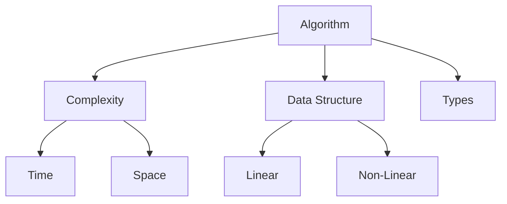

# 算法概览

## 基础概念

## 算法分类
1. 排序算法
   - 冒泡排序 O(n²)
   - 快速排序 O(nlogn)
   - 归并排序 O(nlogn)
   - 堆排序 O(nlogn)

2. 搜索算法
   - 二分查找 O(logn)
   - 深度优先搜索 (DFS)
   - 广度优先搜索 (BFS)
   - A*算法

3. 图论算法
   - 最短路径 (Dijkstra)
   - 最小生成树 (Prim/Kruskal)
   - 拓扑排序
   - 并查集

4. 动态规划
   - 背包问题
   - 最长公共子序列
   - 最长递增子序列
   - 编辑距离

## 数据结构
1. 线性结构
   - 数组
   - 链表
   - 栈
   - 队列

2. 树形结构
   - 二叉树
   - 平衡树
   - B树/B+树
   - Trie树

3. 图结构
   - 邻接矩阵
   - 邻接表
   - 十字链表
   - 并查集

## 复杂度分析
1. 时间复杂度
   - O(1) 常数
   - O(logn) 对数
   - O(n) 线性
   - O(nlogn) 线性对数
   - O(n²) 平方

2. 空间复杂度
   - 原地算法
   - 辅助空间
   - 递归栈空间

## 算法技巧
1. 双指针技巧
2. 滑动窗口
3. 分治法
4. 回溯法
5. 贪心算法

## 进阶主题
1. 字符串算法
   - KMP算法
   - Manacher算法
   - 后缀数组

2. 计算几何
   - 凸包
   - 线段相交
   - 点到线距离

## 参考资料
1. [Introduction to Algorithms](https://mitpress.mit.edu/books/introduction-algorithms)
2. [算法（第4版）](https://algs4.cs.princeton.edu/home/)
3. [LeetCode](https://leetcode.com/)
