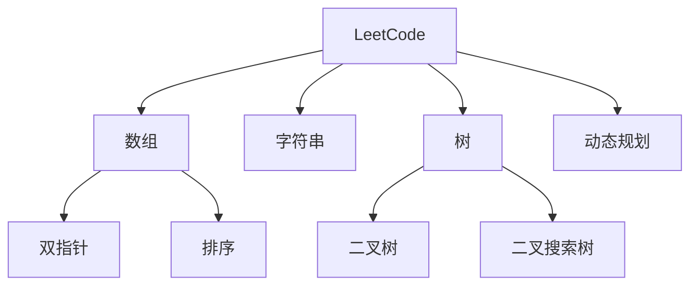

# LeetCode 题解

## 题目分类

## 数组问题
1. 双指针技巧
   - [Two Sum](./array/two_sum.md)
   - [Three Sum](./array/three_sum.md)
   - [Container With Most Water](./array/container_with_water.md)

2. 滑动窗口
   - [Maximum Subarray](./array/maximum_subarray.md)
   - [Minimum Window Substring](./array/minimum_window_substring.md)

## 链表问题
1. 基本操作
   - [Reverse Linked List](./linked_list/reverse_list.md)
   - [Merge Two Sorted Lists](./linked_list/merge_lists.md)

2. 快慢指针
   - [Detect Cycle](./linked_list/detect_cycle.md)
   - [Find Middle Node](./linked_list/find_middle.md)

## 树的问题
1. 遍历方式
   - [Preorder Traversal](./tree/preorder.md)
   - [Inorder Traversal](./tree/inorder.md)
   - [Postorder Traversal](./tree/postorder.md)

2. 构造与变换
   - [Construct Binary Tree](./tree/construct_tree.md)
   - [Flatten Binary Tree](./tree/flatten_tree.md)

## 动态规划
1. 基础问题
   - [Climbing Stairs](./dp/climbing_stairs.md)
   - [Coin Change](./dp/coin_change.md)

2. 进阶问题
   - [Longest Common Subsequence](./dp/lcs.md)
   - [Edit Distance](./dp/edit_distance.md)

## 解题技巧
1. 常用方法
   - 哈希表
   - 双指针
   - 分治法
   - 回溯法

2. 优化思路
   - 空间复杂度优化
   - 时间复杂度优化
   - 代码简化

## 参考资料
1. [LeetCode](https://leetcode.com)
2. [算法导论](https://book.douban.com/subject/1885170/)
3. [剑指Offer](https://book.douban.com/subject/27008702/)
