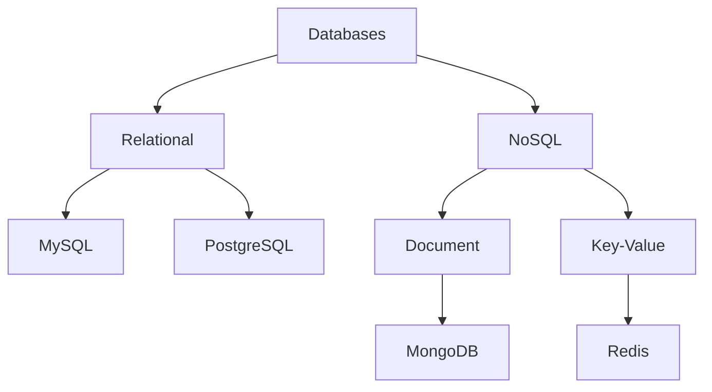

# 数据库概览

## 数据库分类

## 关系型数据库
1. [MySQL](./mysql.md)
   - 广泛应用
   - ACID支持
   - 多存储引擎

2. [PostgreSQL](./postgresql.md)
   - 对象关系型
   - 扩展性强
   - GIS支持

## NoSQL数据库
1. 文档数据库
   - [MongoDB](./mongodb.md)
   - CouchDB
   - Elasticsearch

2. 键值存储
   - [Redis](./redis.md)
   - Memcached
   - LevelDB

## 核心概念
1. ACID特性
   - 原子性 (Atomicity)
   - 一致性 (Consistency)
   - 隔离性 (Isolation)
   - 持久性 (Durability)

2. CAP定理
   - 一致性 (Consistency)
   - 可用性 (Availability)
   - 分区容错性 (Partition tolerance)

## 数据建模
1. ER模型
2. 范式化
3. 索引设计
4. 分片策略

## 性能优化
1. 查询优化
   - 执行计划
   - 索引使用
   - 缓存策略

2. 架构优化
   - 读写分离
   - 分库分表
   - 缓存架构

## 运维管理
1. 备份恢复
2. 监控告警
3. 安全管理
4. 容灾设计

## 参考资料
1. [Database System Concepts](https://db-book.com/)
2. [NoSQL Distilled](https://martinfowler.com/books/nosql.html)
3. [High Performance MySQL](https://www.highperfmysql.com/)
