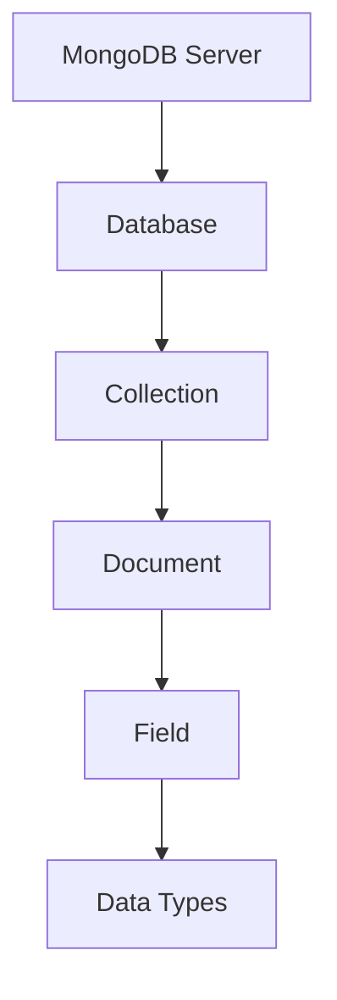

# MongoDB 数据库

## 概述
MongoDB是一个开源的文档型数据库，提供高性能、高可用性和自动扩展的特性。

## 核心概念


## 基本操作
```javascript
// 数据库操作
use mydb

// 集合操作
db.createCollection('users')

// CRUD操作
// 创建
db.users.insertOne({
    name: "John",
    age: 30,
    email: "john@example.com"
})

// 查询
db.users.find({ age: { $gt: 25 }})

// 更新
db.users.updateOne(
    { name: "John" },
    { $set: { age: 31 }}
)

// 删除
db.users.deleteOne({ name: "John" })
```

## 高级特性
1. 索引管理
   - 单字段索引
   - 复合索引
   - 地理空间索引

2. 聚合管理
   - 管道操作
   - MapReduce
   - 单一目的聚合

3. 分布式特性
   - 分片集群
   - 副本集
   - 负载均衡

## 数据建模
1. 文档结构
   - 嵌入式关系
   - 引用关系
   - 数组字段

2. 模式设计
   - 一对一
   - 一对多
   - 多对多

## 性能优化
1. 查询优化
   - 索引使用
   - 查询计划
   - 内存使用

2. 写入优化
   - 批量操作
   - 写关注级别
   - 日志策略

## 运维管理
1. 监控工具
   - MongoDB Compass
   - mongostat
   - mongotop

2. 备份恢复
   - mongodump
   - mongorestore
   - 时间点恢复

3. 安全配置
   - 访问控制
   - 加密传输
   - 审计日志

## 参考资料
1. [MongoDB Manual](https://docs.mongodb.com/manual/)
2. [MongoDB University](https://university.mongodb.com/)
3. [MongoDB Best Practices](https://www.mongodb.com/blog/channel/best-practices)
