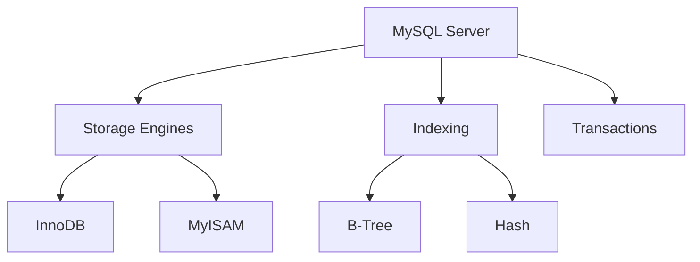

# MySQL 数据库

## 概述
MySQL是一个开源的关系型数据库管理系统，广泛应用于Web应用程序和在线交易处理。

## 核心特性


## 基本操作
```sql
-- 数据库操作
CREATE DATABASE mydb;
USE mydb;

-- 表操作
CREATE TABLE users (
    id INT PRIMARY KEY AUTO_INCREMENT,
    name VARCHAR(50) NOT NULL,
    email VARCHAR(100) UNIQUE,
    created_at TIMESTAMP DEFAULT CURRENT_TIMESTAMP
);

-- CRUD操作
INSERT INTO users (name, email) VALUES ('John', 'john@example.com');
SELECT * FROM users WHERE id = 1;
UPDATE users SET name = 'Johnny' WHERE id = 1;
DELETE FROM users WHERE id = 1;
```

## 高级特性
1. 存储引擎
   - InnoDB
   - MyISAM
   - Memory

2. 事务管理
   - ACID特性
   - 隔离级别
   - 锁机制

3. 索引优化
   - B-Tree索引
   - 复合索引
   - 覆盖索引

## 性能优化
1. 查询优化
   - 执行计划
   - 索引使用
   - JOIN优化

2. 配置调优
   - 缓冲池设置
   - 连接池管理
   - 日志配置

3. 硬件优化
   - 磁盘IO
   - 内存分配
   - CPU使用

## 运维管理
1. 备份恢复
   - 物理备份
   - 逻辑备份
   - 主从复制

2. 监控告警
   - 性能监控
   - 资源使用
   - 慢查询分析

3. 安全管理
   - 用户权限
   - 加密传输
   - 审计日志

## 常见问题
1. 性能问题
   - 慢查询
   - 死锁
   - 连接泄漏

2. 运维问题
   - 主从延迟
   - 备份恢复
   - 数据一致性

## 参考资料
1. [MySQL Documentation](https://dev.mysql.com/doc/)
2. [High Performance MySQL](https://www.oreilly.com/library/view/high-performance-mysql/9781492080503/)
3. [MySQL Internals Manual](https://dev.mysql.com/doc/internals/en/)
