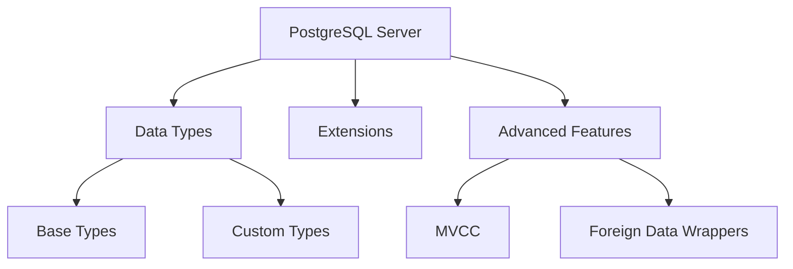

# PostgreSQL 数据库

## 概述
PostgreSQL是一个功能强大的开源对象关系数据库系统，具有高度可扩展性和标准兼容性。

## 核心特性


## 基本操作
```sql
-- 数据库操作
CREATE DATABASE mydb;
\c mydb

-- 表操作
CREATE TABLE users (
    id SERIAL PRIMARY KEY,
    name VARCHAR(50) NOT NULL,
    email VARCHAR(100) UNIQUE,
    created_at TIMESTAMP WITH TIME ZONE DEFAULT CURRENT_TIMESTAMP
);

-- CRUD操作
INSERT INTO users (name, email) VALUES ('John', 'john@example.com');
SELECT * FROM users WHERE id = 1;
UPDATE users SET name = 'Johnny' WHERE id = 1;
DELETE FROM users WHERE id = 1;
```

## 高级特性
1. 数据类型
   - JSON/JSONB
   - 数组
   - 地理信息
   - 自定义类型

2. 并发控制
   - MVCC
   - 事务隔离
   - 锁机制

3. 扩展功能
   - 外部数据包装器
   - 存储过程
   - 触发器

## 性能优化
1. 查询优化
   - 执行计划
   - 索引策略
   - 分区表

2. 配置调优
   - 内存配置
   - 缓冲区设置
   - WAL配置

3. 监控分析
   - 统计信息
   - 性能视图
   - 日志分析

## 运维管理
1. 备份恢复
   - pg_dump
   - pg_basebackup
   - 时间点恢复

2. 高可用方案
   - 流复制
   - 逻辑复制
   - 故障转移

3. 安全管理
   - 角色管理
   - 访问控制
   - SSL配置

## 常见问题
1. 性能问题
   - 查询慢
   - 死锁
   - 空间膨胀

2. 运维问题
   - 复制延迟
   - 连接管理
   - 版本升级

## 参考资料
1. [PostgreSQL Documentation](https://www.postgresql.org/docs/)
2. [PostgreSQL Tutorial](https://www.postgresqltutorial.com/)
3. [PostgreSQL Best Practices](https://wiki.postgresql.org/wiki/Main_Page)
