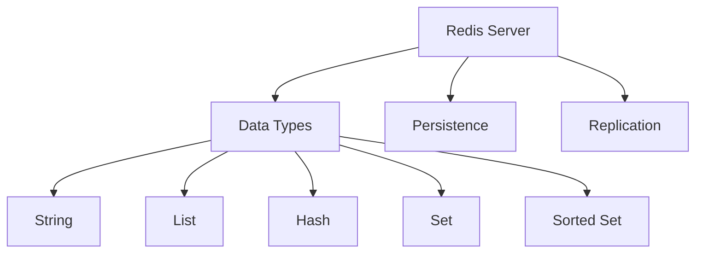

# Redis 数据库

## 概述
Redis是一个开源的内存数据结构存储系统，可以用作数据库、缓存、消息代理和队列。

## 核心特性


## 基本命令
```bash
# 字符串操作
SET key value
GET key
DEL key

# 哈希表操作
HSET hash field value
HGET hash field
HDEL hash field

# 列表操作
LPUSH list value
RPUSH list value
LRANGE list start stop
```

## 数据类型命令
```bash
# Strings
SET user:1:name "John"
INCR counter
EXPIRE session:123 3600

# Lists
LPUSH notifications msg1
BRPOP queue 5
LLEN mylist

# Sets
SADD tags "redis" "cache" "nosql"
SINTER set1 set2
SCARD myset

# Sorted Sets
ZADD leaderboard 100 user1
ZRANGE leaderboard 0 10 WITHSCORES
ZRANK leaderboard user1

# Hashes
HMSET user:1 name "John" age "30"
HINCRBY user:1 visits 1
HGETALL user:1
```

## 配置示例
```conf
# 基本配置
bind 127.0.0.1
port 6379
daemonize yes
dir /var/lib/redis

# 持久化配置
save 900 1
save 300 10
save 60 10000
appendonly yes
appendfsync everysec

# 主从配置
replicaof 192.168.1.1 6379
masterauth <master-password>
replica-read-only yes
```

## 高级特性
1. 数据持久化
   - RDB快照
   - AOF日志
   - 混合持久化

2. 主从复制
   - 异步复制
   - 主从切换
   - 哨兵模式

3. 集群模式
   - 分片机制
   - 故障转移
   - 扩容收缩

## 监控管理
1. 性能监控
   - INFO命令
   - 延迟监控
   - 内存分析

2. 运维工具
   - redis-cli
   - redis-benchmark
   - redis-stat

3. 故障排查
   - 慢查询日志
   - 大key分析
   - 网络延迟

## 最佳实践
1. 数据结构选择
   - 合适的类型
   - 内存优化
   - 过期策略

2. 性能优化
   - 批量操作
   - 连接池
   - 监控指标

3. 安全配置
   - 访问控制
   - 网络安全
   - 数据加密

## 应用场景
1. 缓存系统
   - 数据缓存
   - 会话存储
   - 页面缓存

2. 计数器服务
   - 访问统计
   - 限流控制
   - 排行榜

3. 消息队列
   - 发布订阅
   - 延迟队列
   - 任务队列

## 常见问题
1. 缓存问题
   - 缓存穿透
   - 缓存击穿
   - 缓存雪崩

2. 内存问题
   - 内存碎片
   - 内存溢出
   - 淘汰策略

## 参考资料
1. [Redis Documentation](https://redis.io/documentation)
2. [Redis in Action](https://redislabs.com/ebook/redis-in-action/)
3. [Redis Design Patterns](https://redislabs.com/redis-best-practices/introduction/)
