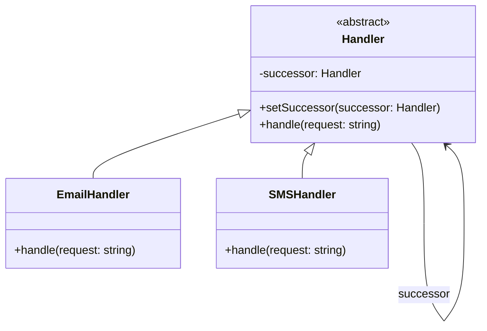

# 责任链模式 (Chain of Responsibility Pattern)

## 概述
责任链模式是一种行为设计模式，它允许你将请求沿着处理者链进行发送。收到请求后，每个处理者均可对请求进行处理，或将它传递给链中的下一个处理者。

## UML类图


## 代码示例
```typescript
// 请求处理者接口
abstract class Handler {
    protected successor: Handler | null = null;
    
    setSuccessor(successor: Handler): void {
        this.successor = successor;
    }
    
    abstract handle(request: string): void;
}

// 具体处理者
class EmailHandler extends Handler {
    handle(request: string): void {
        if (request.includes('email')) {
            console.log('Email handler processing request');
        } else if (this.successor) {
            this.successor.handle(request);
        }
    }
}

class SMSHandler extends Handler {
    handle(request: string): void {
        if (request.includes('sms')) {
            console.log('SMS handler processing request');
        } else if (this.successor) {
            this.successor.handle(request);
        }
    }
}

// 使用示例
const emailHandler = new EmailHandler();
const smsHandler = new SMSHandler();

emailHandler.setSuccessor(smsHandler);

emailHandler.handle('email notification');  // Email handler processing
emailHandler.handle('sms notification');    // SMS handler processing
```

## 实现方式
1. 定义处理者接口
   - 声明处理方法
   - 定义设置后继者方法

2. 实现具体处理者
   - 实现处理逻辑
   - 设置请求传递机制
   - 处理或转发请求

## 使用场景
1. 多个对象可以处理请求
2. 运行时动态指定处理者
3. 不明确接收者的请求处理
4. 有多个处理者的请求处理

## 优缺点

### 优点
- 降低耦合度
- 动态组织责任链
- 增强职责分配灵活性
- 符合开闭原则

### 缺点
- 请求可能未被处理
- 性能可能受影响
- 调试和测试复杂

## 实际应用
1. 日志框架
   - Log4j级别处理
   - SLF4J日志过滤

2. Web开发
   - Servlet过滤器
   - Spring Security过滤器链
   - 中间件处理管道

3. 异常处理
   - 异常处理链
   - 错误恢复机制

## 最佳实践
1. 合理设置责任链长度
2. 避免循环引用
3. 注意性能影响
4. 确保请求被处理
5. 使用建造者模式构建链

## 参考资料
1. [Design Patterns: Elements of Reusable Object-Oriented Software](https://book.douban.com/subject/1052241/)
2. [Head First Design Patterns](https://book.douban.com/subject/2243615/)
3. [Refactoring Guru: Chain of Responsibility](https://refactoringguru.cn/design-patterns/chain-of-responsibility)