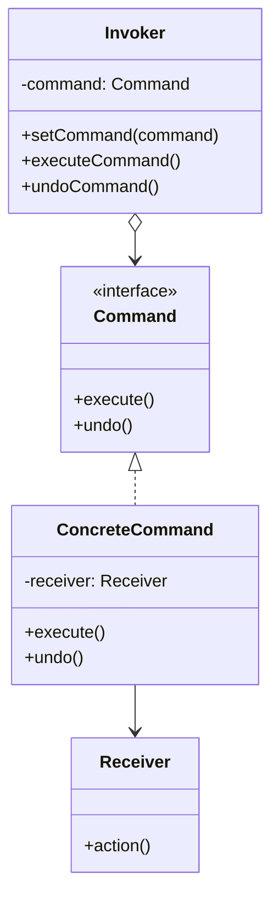

# 命令模式 (Command Pattern)

## 概述
命令模式是一种行为设计模式，它将请求封装为一个对象，从而让你可以使用不同的请求参数化客户端，实现请求的排队、记录日志、撤销等操作。

## UML类图


## 代码示例
```typescript
// 命令接口
interface Command {
    execute(): void;
    undo(): void;
}

// 接收者
class Light {
    private isOn: boolean = false;
    
    turnOn(): void {
        this.isOn = true;
        console.log('Light is on');
    }
    
    turnOff(): void {
        this.isOn = false;
        console.log('Light is off');
    }
}

// 具体命令
class LightOnCommand implements Command {
    private light: Light;
    
    constructor(light: Light) {
        this.light = light;
    }
    
    execute(): void {
        this.light.turnOn();
    }
    
    undo(): void {
        this.light.turnOff();
    }
}

// 调用者
class RemoteControl {
    private command: Command | null = null;
    
    setCommand(command: Command): void {
        this.command = command;
    }
    
    pressButton(): void {
        if (this.command) {
            this.command.execute();
        }
    }
    
    pressUndo(): void {
        if (this.command) {
            this.command.undo();
        }
    }
}

// 使用示例
const light = new Light();
const lightOn = new LightOnCommand(light);
const remote = new RemoteControl();

remote.setCommand(lightOn);
remote.pressButton();  // Light is on
remote.pressUndo();    // Light is off
```

## 实现方式
1. 定义命令接口
   - 声明执行方法
   - 声明撤销方法

2. 创建具体命令
   - 实现命令接口
   - 关联接收者
   - 委派实际操作

## 使用场景
1. 参数化对象的操作
2. 实现操作的排队和延迟执行
3. 支持撤销和恢复操作
4. 实现事务和日志记录

## 优缺点

### 优点
- 解耦发送者和接收者
- 可扩展新命令
- 支持撤销操作
- 支持组合命令

### 缺点
- 增加类的数量
- 每个命令都是一个单独类
- 可能导致系统较复杂

## 实际应用
1. GUI开发
   - 按钮点击事件
   - 菜单项操作
   - 快捷键绑定

2. 事务处理
   - 数据库事务
   - 操作日志
   - 撤销重做

3. 任务队列
   - 消息队列
   - 线程池任务
   - 批处理操作

## 最佳实践
1. 设计简单的命令接口
2. 考虑命令的撤销操作
3. 使用组合命令处理复杂操作
4. 实现命令的序列化
5. 注意内存使用

## 参考资料
1. [Design Patterns: Elements of Reusable Object-Oriented Software](https://book.douban.com/subject/1052241/)
2. [Head First Design Patterns](https://book.douban.com/subject/2243615/)
3. [Refactoring Guru: Command Pattern](https://refactoringguru.cn/design-patterns/command)
