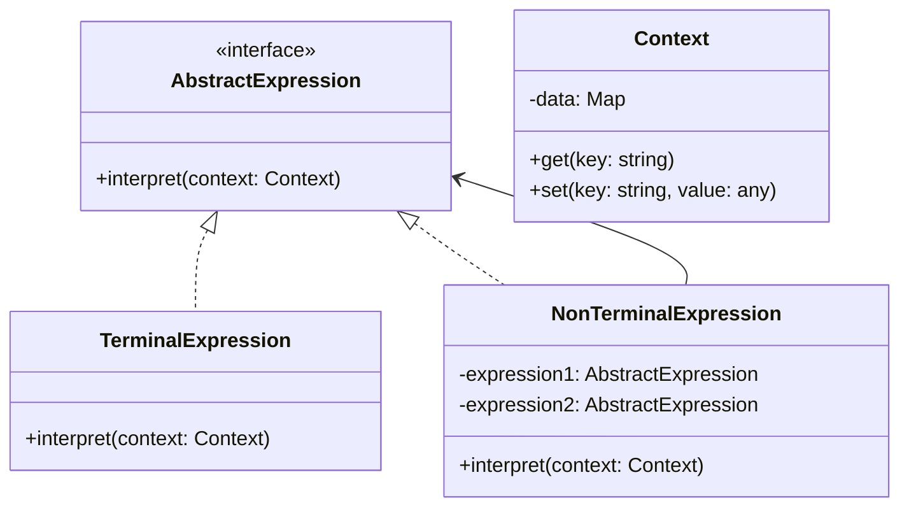

# 解释器模式 (Interpreter Pattern)

## 概述
解释器模式是一种行为设计模式，它定义如何为简单的语言定义一个语法，并建立一个解释器来解释该语言中的句子。这种模式通常用于设计编译器、规则引擎等。

## UML类图


## 代码示例
```typescript
// 上下文类，存储解释器需要的全局信息
class Context {
    private variables: Map<string, number> = new Map();
    
    set(variable: string, value: number): void {
        this.variables.set(variable, value);
    }
    
    get(variable: string): number {
        return this.variables.get(variable) || 0;
    }
}

// 表达式接口
interface Expression {
    interpret(context: Context): number;
}

// 数字表达式
class NumberExpression implements Expression {
    constructor(private number: number) {}
    
    interpret(context: Context): number {
        return this.number;
    }
}

// 变量表达式
class VariableExpression implements Expression {
    constructor(private variable: string) {}
    
    interpret(context: Context): number {
        return context.get(this.variable);
    }
}

// 加法表达式
class AddExpression implements Expression {
    constructor(
        private left: Expression,
        private right: Expression
    ) {}
    
    interpret(context: Context): number {
        return this.left.interpret(context) + this.right.interpret(context);
    }
}

// 使用示例
const context = new Context();
context.set("x", 10);
context.set("y", 5);

const expression = new AddExpression(
    new VariableExpression("x"),
    new NumberExpression(2)
);

console.log(expression.interpret(context)); // 输出: 12
```

## 实现方式
1. 定义文法规则
   - 确定语言的语法规则
   - 设计表达式接口
   - 实现解释方法

2. 构建语法树
   - 实现终结符表达式
   - 实现非终结符表达式
   - 组合形成语法树

## 使用场景
1. 需要解释简单语法规则
2. 需要实现DSL（领域特定语言）
3. 规则引擎的实现
4. SQL解析器

## 优缺点

### 优点
- 易于改变和扩展文法
- 实现文法较为容易
- 增加新的解释表达式方便

### 缺点
- 复杂文法难以维护
- 执行效率较低
- 可能产生过多的类

## 实际应用
1. 编译器实现
   - 词法分析器
   - 语法分析器
   - 表达式求值

2. 规则引擎
   - Drools
   - SQL解析器
   - 正则表达式解析

3. 数学表达式
   - 计算器
   - 公式解析
   - 数学函数计算

## 最佳实践
1. 保持语法规则简单
2. 使用组合模式构建语法树
3. 考虑使用缓存优化性能
4. 适当使用访问者模式
5. 注意错误处理机制

## 参考资料
1. [Design Patterns: Elements of Reusable Object-Oriented Software](https://book.douban.com/subject/1052241/)
2. [Head First Design Patterns](https://book.douban.com/subject/2243615/)
3. [Refactoring Guru: Interpreter Pattern](https://refactoringguru.cn/design-patterns/interpreter)
