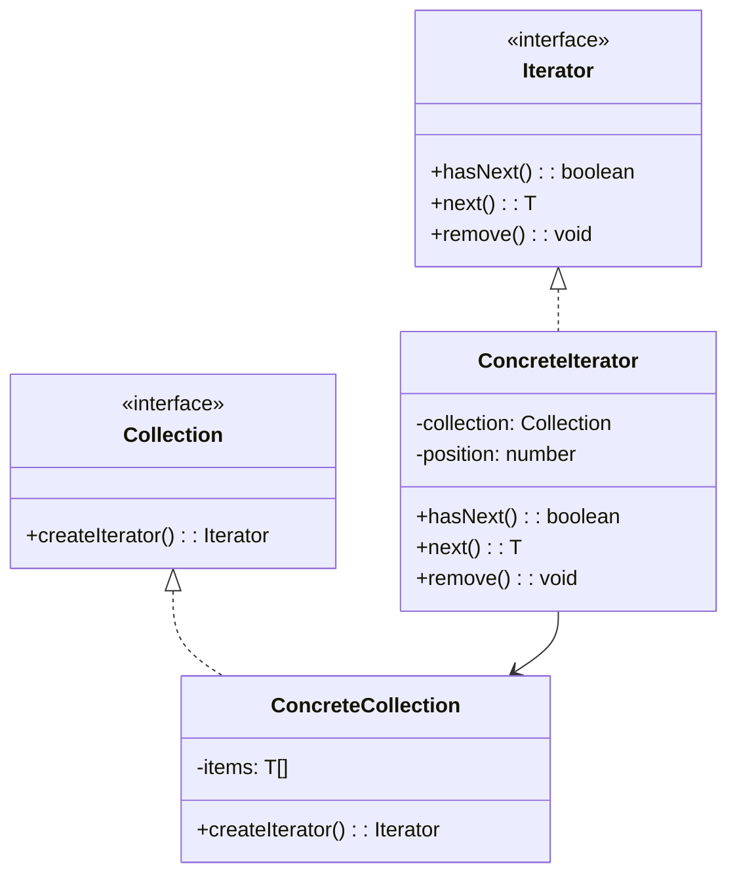

# 迭代器模式 (Iterator Pattern)

## 概述
迭代器模式是一种行为设计模式，它提供一种方法顺序访问一个聚合对象中的各个元素，而无需暴露该对象的内部表示。

## UML类图


## 代码示例
```typescript
interface Iterator<T> {
    hasNext(): boolean;
    next(): T;
    current(): T;
}

interface Collection<T> {
    createIterator(): Iterator<T>;
}

class BookIterator implements Iterator<Book> {
    private position: number = 0;
    
    constructor(private books: Book[]) {}
    
    hasNext(): boolean {
        return this.position < this.books.length;
    }
    
    next(): Book {
        const book = this.books[this.position];
        this.position++;
        return book;
    }
    
    current(): Book {
        return this.books[this.position];
    }
}

class BookShelf implements Collection<Book> {
    private books: Book[] = [];
    
    addBook(book: Book): void {
        this.books.push(book);
    }
    
    createIterator(): Iterator<Book> {
        return new BookIterator(this.books);
    }
}

// 使用示例
const bookshelf = new BookShelf();
bookshelf.addBook(new Book("Design Patterns"));
bookshelf.addBook(new Book("Clean Code"));

const iterator = bookshelf.createIterator();
while (iterator.hasNext()) {
    console.log(iterator.next().title);
}
```

## 实现方式
1. 定义迭代器接口
   - 声明遍历方法
   - 确定迭代方式

2. 实现集合接口
   - 创建迭代器
   - 管理元素集合

## 使用场景
1. 访问复杂数据结构
2. 统一遍历接口
3. 并行遍历同一集合
4. 需要对遍历进行控制

## 优缺点

### 优点
- 单一职责原则
- 支持并行遍历
- 统一遍历接口
- 简化客户端代码

### 缺点
- 对于简单集合可能过度设计
- 使用迭代器可能比直接遍历慢
- 增加类的数量

## 实际应用
1. 集合框架
   - Java Collections
   - C# IEnumerable
   - Python Iterators

2. 数据库访问
   - 结果集迭代
   - 分页查询
   - 游标操作

3. UI组件
   - DOM遍历
   - 树形结构
   - 菜单遍历

## 最佳实践
1. 选择合适的迭代方式
2. 注意迭代器状态维护
3. 考虑线程安全性
4. 实现快照迭代
5. 处理并发修改

## 参考资料
1. [Design Patterns: Elements of Reusable Object-Oriented Software](https://book.douban.com/subject/1052241/)
2. [Head First Design Patterns](https://book.douban.com/subject/2243615/)
3. [Refactoring Guru: Iterator Pattern](https://refactoringguru.cn/design-patterns/iterator)
