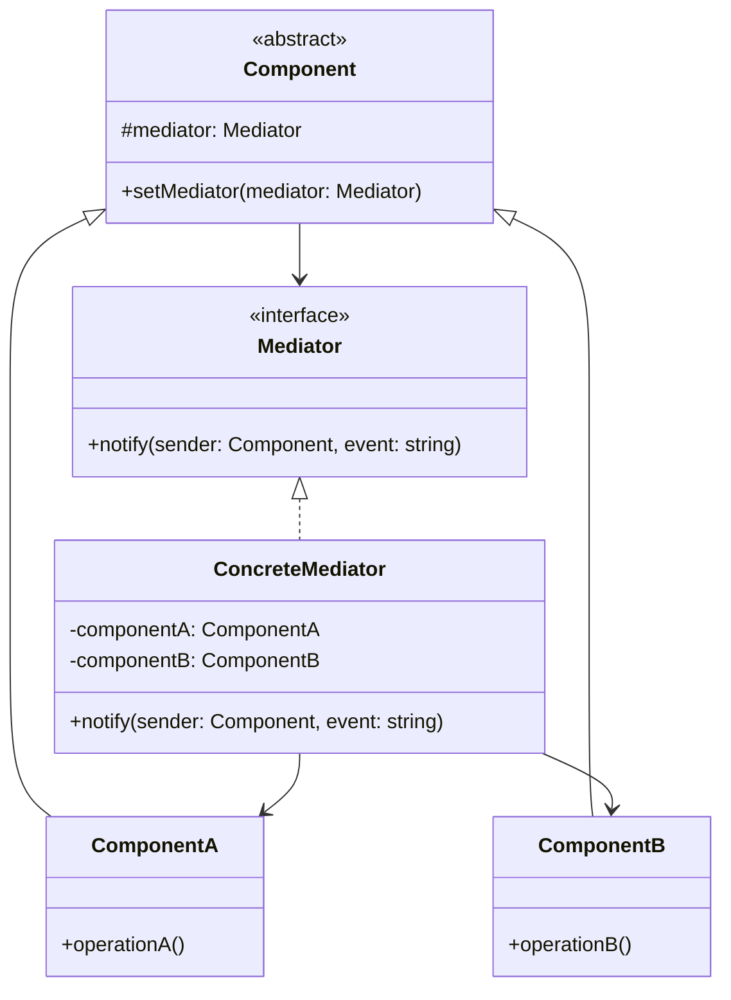

# 中介者模式 (Mediator Pattern)

## 概述
中介者模式是一种行为设计模式，它通过封装一系列对象之间的交互方式，使得这些对象不必显式地相互引用，从而使其松散耦合。

## UML类图


## 代码示例
```typescript
interface Mediator {
    notify(sender: Component, event: string): void;
}

abstract class Component {
    protected mediator: Mediator;

    constructor(mediator: Mediator) {
        this.mediator = mediator;
    }
}

class ChatRoom implements Mediator {
    private users: Map<string, User> = new Map();

    addUser(user: User): void {
        this.users.set(user.name, user);
    }

    notify(sender: Component, event: string): void {
        if (sender instanceof User) {
            this.users.forEach(user => {
                if (user.name !== sender.name) {
                    user.receive(`${sender.name}: ${event}`);
                }
            });
        }
    }
}

class User extends Component {
    name: string;

    constructor(name: string, mediator: Mediator) {
        super(mediator);
        this.name = name;
    }

    send(message: string): void {
        console.log(`${this.name} sending: ${message}`);
        this.mediator.notify(this, message);
    }

    receive(message: string): void {
        console.log(`${this.name} received: ${message}`);
    }
}

// 使用示例
const chatRoom = new ChatRoom();
const alice = new User("Alice", chatRoom);
const bob = new User("Bob", chatRoom);

chatRoom.addUser(alice);
chatRoom.addUser(bob);

alice.send("Hello!");  // Alice发送消息到聊天室
```

## 实现方式
1. 定义中介者接口
   - 声明通信方法
   - 定义组件交互协议

2. 实现具体中介者
   - 协调组件之间的交互
   - 维护组件关系
   - 处理通信逻辑

## 使用场景
1. 对象之间存在复杂的通信关系
2. 组件需要被重用
3. 多对多的依赖关系
4. 需要集中控制交互

## 优缺点

### 优点
- 减少组件之间的耦合
- 集中控制交互逻辑
- 简化组件间通信
- 提高组件可重用性

### 缺点
- 中介者可能过于复杂
- 可能形成过度集中的控制点
- 可能降低性能

## 实际应用
1. GUI开发
   - 窗口组件交互
   - 事件处理系统
   - MVC框架中的Controller

2. 即时通讯
   - 聊天室系统
   - 消息分发
   - 多人游戏

3. 航空管制
   - 航空管制系统
   - 交通控制
   - 资源调度

## 最佳实践
1. 明确定义通信协议
2. 避免中介者过度膨胀
3. 考虑使用观察者模式
4. 注意并发问题
5. 合理划分职责边界

## 参考资料
1. [Design Patterns: Elements of Reusable Object-Oriented Software](https://book.douban.com/subject/1052241/)
2. [Head First Design Patterns](https://book.douban.com/subject/2243615/)
3. [Refactoring Guru: Mediator Pattern](https://refactoringguru.cn/design-patterns/mediator)
