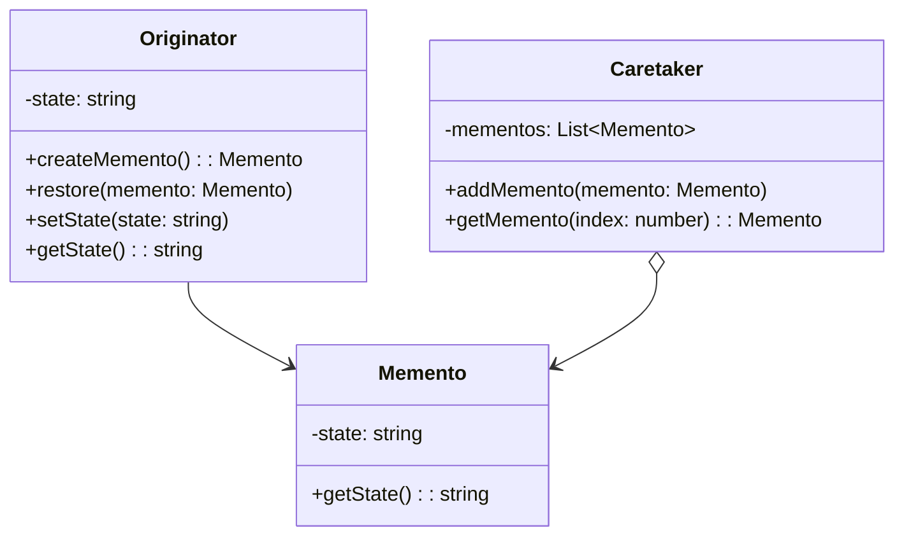

# 备忘录模式 (Memento Pattern)

## 概述
备忘录模式是一种行为设计模式，它允许在不暴露对象实现细节的情况下保存和恢复对象之前的状态。

## UML类图


## 代码示例
```typescript
class EditorMemento {
    constructor(private content: string) {}
    
    getContent(): string {
        return this.content;
    }
}

class Editor {
    private content: string = '';
    
    setContent(content: string): void {
        this.content = content;
    }
    
    getContent(): string {
        return this.content;
    }
    
    save(): EditorMemento {
        return new EditorMemento(this.content);
    }
    
    restore(memento: EditorMemento): void {
        this.content = memento.getContent();
    }
}

class History {
    private mementos: EditorMemento[] = [];
    
    push(memento: EditorMemento): void {
        this.mementos.push(memento);
    }
    
    pop(): EditorMemento | undefined {
        return this.mementos.pop();
    }
}

// 使用示例
const editor = new Editor();
const history = new History();

editor.setContent("Hello");
history.push(editor.save());

editor.setContent("Hello World");
history.push(editor.save());

editor.setContent("Hello World!!!");
console.log(editor.getContent()); // Hello World!!!

// 撤销到上一个状态
const lastMemento = history.pop();
if (lastMemento) {
    editor.restore(lastMemento);
    console.log(editor.getContent()); // Hello World
}
```

## 实现方式
1. 创建备忘录类
   - 保存状态信息
   - 限制外部访问

2. 实现发起人类
   - 创建备忘录
   - 恢复状态
   - 管理当前状态

## 使用场景
1. 需要实现撤销/恢复功能
2. 需要保存对象状态快照
3. 直接访问对象状态违反封装

## 优缺点

### 优点
- 不破坏封装性
- 提供可靠的恢复机制
- 简化发起人类
- 易于实现

### 缺点
- 资源消耗较大
- 可能需要大量内存
- 可能影响性能

## 实际应用
1. 编辑器
   - 撤销/重做功能
   - 自动保存
   - 版本控制

2. 游戏开发
   - 存档功能
   - 状态回滚
   - 历史记录

3. 数据库
   - 事务回滚
   - 检查点
   - 备份恢复

## 最佳实践
1. 控制备忘录数量
2. 考虑序列化机制
3. 注意内存使用
4. 实现增量存储
5. 使用压缩算法

## 参考资料
1. [Design Patterns: Elements of Reusable Object-Oriented Software](https://book.douban.com/subject/1052241/)
2. [Head First Design Patterns](https://book.douban.com/subject/2243615/)
3. [Refactoring Guru: Memento Pattern](https://refactoringguru.cn/design-patterns/memento)
