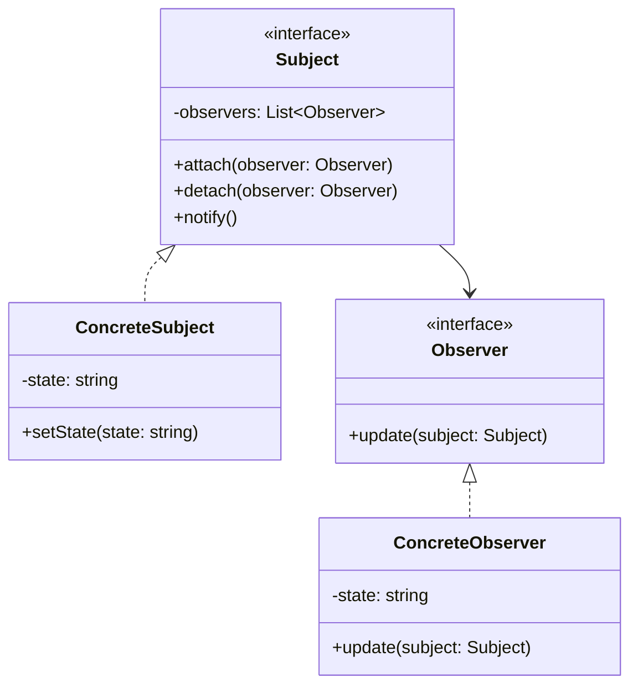

# 观察者模式 (Observer Pattern)

## 概述
观察者模式是一种行为设计模式，它定义了一种一对多的依赖关系，让多个观察者对象同时监听某一个主题对象。这个主题对象在状态发生变化时，会通知所有观察者对象，使它们能够自动更新自己。

## UML类图


## 代码示例
```typescript
interface Observer {
    update(temperature: number, humidity: number): void;
}

class WeatherStation {
    private observers: Observer[] = [];
    private temperature: number = 0;
    private humidity: number = 0;
    
    attach(observer: Observer): void {
        this.observers.push(observer);
    }
    
    detach(observer: Observer): void {
        const index = this.observers.indexOf(observer);
        if (index !== -1) {
            this.observers.splice(index, 1);
        }
    }
    
    setMeasurements(temperature: number, humidity: number): void {
        this.temperature = temperature;
        this.humidity = humidity;
        this.notifyObservers();
    }
    
    private notifyObservers(): void {
        for (const observer of this.observers) {
            observer.update(this.temperature, this.humidity);
        }
    }
}

class DisplayDevice implements Observer {
    private id: string;
    
    constructor(id: string) {
        this.id = id;
    }
    
    update(temperature: number, humidity: number): void {
        console.log(`Display ${this.id}: Temperature: ${temperature}°C, Humidity: ${humidity}%`);
    }
}

// 使用示例
const weatherStation = new WeatherStation();
const display1 = new DisplayDevice("1");
const display2 = new DisplayDevice("2");

weatherStation.attach(display1);
weatherStation.attach(display2);

weatherStation.setMeasurements(25, 60);
```

## 实现方式
1. 创建主题接口
   - 定义观察者管理方法
   - 实现通知机制

2. 实现具体主题
   - 维护观察者列表
   - 状态更新时通知观察者

## 使用场景
1. 一对多的依赖关系
2. 状态改变需要通知其他对象
3. 解耦通知者和接收者
4. 实现发布-订阅模式

## 优缺点

### 优点
- 符合开闭原则
- 支持广播通信
- 建立了对象之间的抽象耦合
- 灵活性高

### 缺点
- 可能导致循环引用
- 通知顺序不可控
- 可能产生性能问题

## 实际应用
1. 事件处理系统
   - DOM事件
   - GUI框架
   - 事件总线

2. 消息推送
   - 消息队列
   - 实时通知
   - 数据同步

3. 状态监控
   - 系统监控
   - 日志记录
   - 性能追踪

## 最佳实践
1. 考虑线程安全
2. 避免通知死循环
3. 合理管理观察者
4. 使用弱引用防止内存泄漏
5. 实现通知优先级

## 参考资料
1. [Design Patterns: Elements of Reusable Object-Oriented Software](https://book.douban.com/subject/1052241/)
2. [Head First Design Patterns](https://book.douban.com/subject/2243615/)
3. [Refactoring Guru: Observer Pattern](https://refactoringguru.cn/design-patterns/observer)
