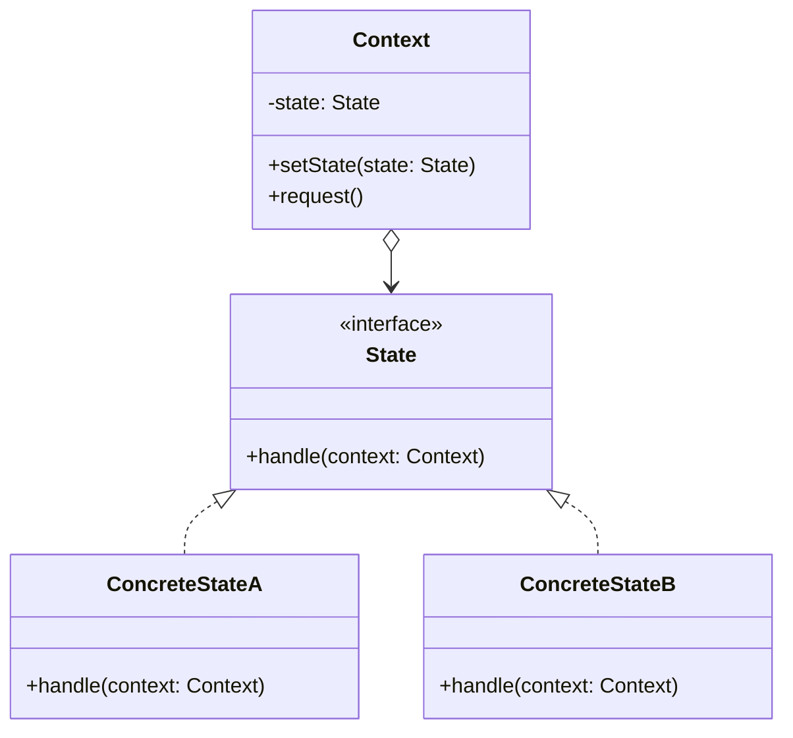

# 状态模式 (State Pattern)

## 概述
状态模式是一种行为设计模式，它允许一个对象在其内部状态改变时改变它的行为。这个对象看起来就像是改变了它的类一样。

## UML类图


## 代码示例
```typescript
interface VendingMachineState {
    insertCoin(): void;
    ejectCoin(): void;
    selectProduct(): void;
    dispense(): void;
}

class VendingMachine {
    private state: VendingMachineState;
    private hasCoins: boolean = false;
    
    constructor() {
        this.state = new NoCoinState(this);
    }
    
    setState(state: VendingMachineState): void {
        this.state = state;
    }
    
    insertCoin(): void {
        this.state.insertCoin();
    }
    
    ejectCoin(): void {
        this.state.ejectCoin();
    }
    
    selectProduct(): void {
        this.state.selectProduct();
    }
    
    dispense(): void {
        this.state.dispense();
    }
    
    setHasCoins(value: boolean): void {
        this.hasCoins = value;
    }
}

class NoCoinState implements VendingMachineState {
    constructor(private machine: VendingMachine) {}
    
    insertCoin(): void {
        console.log("Coin inserted");
        this.machine.setHasCoins(true);
        this.machine.setState(new HasCoinState(this.machine));
    }
    
    ejectCoin(): void {
        console.log("No coin to eject");
    }
    
    selectProduct(): void {
        console.log("Please insert a coin first");
    }
    
    dispense(): void {
        console.log("Please insert a coin first");
    }
}

// 使用示例
const machine = new VendingMachine();
machine.selectProduct();  // Please insert a coin first
machine.insertCoin();     // Coin inserted
machine.selectProduct();  // Product selected
```

## 实现方式
1. 定义状态接口
   - 声明所有可能的行为
   - 确保状态间的一致性

2. 实现具体状态
   - 处理特定状态下的行为
   - 管理状态转换
   - 维护上下文引用

## 使用场景
1. 对象行为随状态改变
2. 大量条件语句切换行为
3. 需要状态机制的场景
4. 状态转换规则复杂

## 优缺点

### 优点
- 封装状态相关行为
- 消除条件语句
- 使状态转换显式化
- 状态类可共享

### 缺点
- 增加类的数量
- 可能导致状态类膨胀
- 增加系统复杂度

## 实际应用
1. 工作流引擎
   - 订单状态流转
   - 审批流程
   - 任务状态管理

2. 游戏开发
   - 角色状态
   - 游戏进程
   - AI行为状态

3. UI交互
   - 按钮状态
   - 表单验证
   - 页面状态

## 最佳实践
1. 明确定义状态转换
2. 避免状态类过多
3. 考虑状态共享
4. 使用状态机框架
5. 注意并发问题

## 参考资料
1. [Design Patterns: Elements of Reusable Object-Oriented Software](https://book.douban.com/subject/1052241/)
2. [Head First Design Patterns](https://book.douban.com/subject/2243615/)
3. [Refactoring Guru: State Pattern](https://refactoringguru.cn/design-patterns/state)
