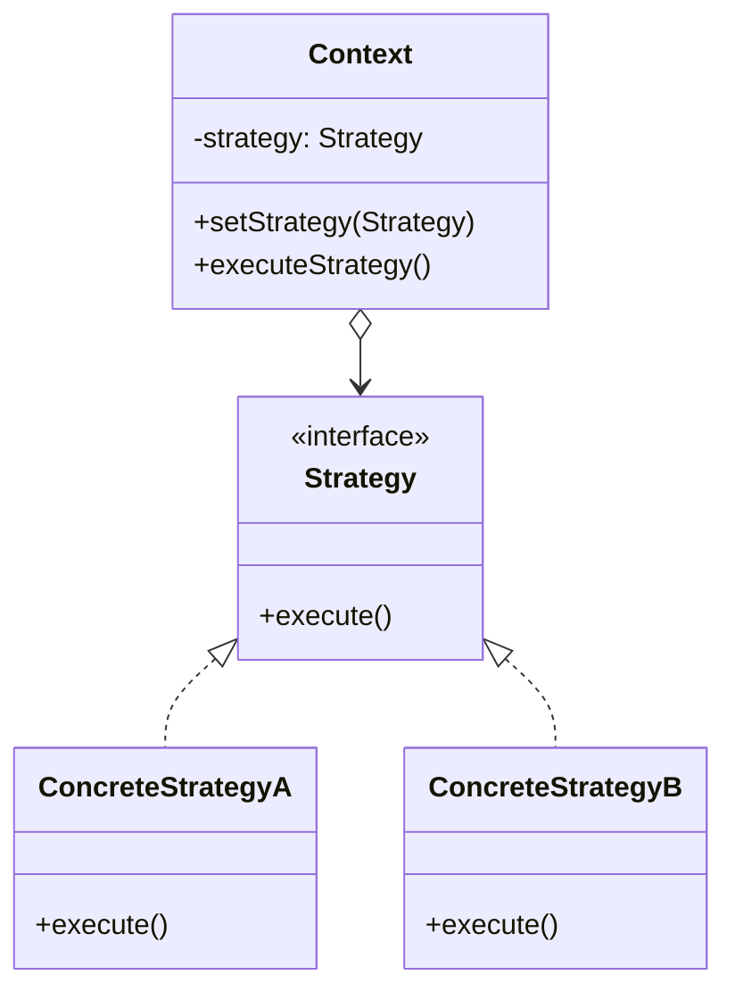

# 策略模式 (Strategy Pattern)

## 概述
策略模式是一种行为设计模式，它定义了一系列算法，并将每个算法封装起来，使它们可以相互替换。策略模式让算法独立于使用它的客户端而变化。

## UML类图


## 代码示例
```typescript
interface PaymentStrategy {
    pay(amount: number): void;
}

class CreditCardPayment implements PaymentStrategy {
    constructor(private cardNumber: string) {}
    
    pay(amount: number): void {
        console.log(`Paid ${amount} using Credit Card ${this.cardNumber}`);
    }
}

class PayPalPayment implements PaymentStrategy {
    constructor(private email: string) {}
    
    pay(amount: number): void {
        console.log(`Paid ${amount} using PayPal account ${this.email}`);
    }
}

class ShoppingCart {
    private paymentStrategy: PaymentStrategy;
    
    setPaymentStrategy(strategy: PaymentStrategy): void {
        this.paymentStrategy = strategy;
    }
    
    checkout(amount: number): void {
        this.paymentStrategy.pay(amount);
    }
}

// 使用示例
const cart = new ShoppingCart();
cart.setPaymentStrategy(new CreditCardPayment("1234-5678"));
cart.checkout(100);  // Paid 100 using Credit Card 1234-5678

cart.setPaymentStrategy(new PayPalPayment("user@example.com"));
cart.checkout(50);   // Paid 50 using PayPal account user@example.com
```

## 实现方式
1. 声明策略接口
   - 定义算法公共方法
   - 确保策略可互换

2. 实现具体策略
   - 封装特定算法
   - 实现策略接口
   - 保持独立性

## 使用场景
1. 算法可以互换
2. 需要在运行时选择算法
3. 有一组类似的算法
4. 算法应该独立于使用它的代码

## 优缺点

### 优点
- 算法可以自由切换
- 避免使用多重条件判断
- 易于扩展新策略
- 策略可以复用

### 缺点
- 增加策略类的数量
- 客户端需要了解策略差异
- 部分策略可能用不到

## 实际应用
1. 支付系统
   - 支付方式选择
   - 优惠策略
   - 配送方式

2. 排序算法
   - Collections.sort()
   - 自定义比较器
   - 排序策略切换

3. 数据压缩
   - 压缩算法选择
   - 编码方式
   - 加密策略

## 最佳实践
1. 使用工厂模式创建策略
2. 考虑策略的默认实现
3. 使用依赖注入
4. 注意策略切换的时机
5. 避免过度使用

## 参考资料
1. [Design Patterns: Elements of Reusable Object-Oriented Software](https://book.douban.com/subject/1052241/)
2. [Head First Design Patterns](https://book.douban.com/subject/2243615/)
3. [Refactoring Guru: Strategy Pattern](https://refactoringguru.cn/design-patterns/strategy)
