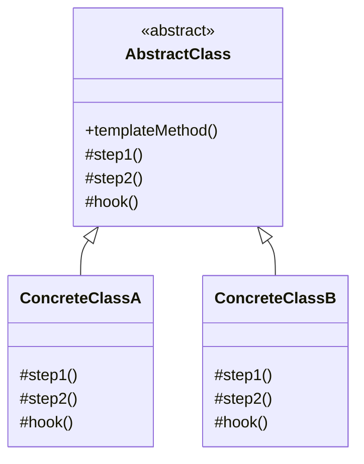

# 模板方法模式 (Template Method Pattern)

## 概述
模板方法模式是一种行为设计模式，它在一个方法中定义一个算法的骨架，将某些步骤延迟到子类中实现。模板方法使得子类可以在不改变算法结构的情况下，重新定义算法的某些步骤。

## UML类图


## 代码示例
```typescript
abstract class DataMiner {
    // 模板方法
    public mine(): void {
        this.openFile();
        this.extractData();
        this.parseData();
        if (this.shouldAnalyze()) {
            this.analyzeData();
        }
        this.sendReport();
    }
    
    protected abstract openFile(): void;
    protected abstract extractData(): void;
    
    protected parseData(): void {
        console.log("Parsing data...");
    }
    
    protected analyzeData(): void {
        console.log("Analyzing data...");
    }
    
    // 钩子方法
    protected shouldAnalyze(): boolean {
        return true;
    }
    
    private sendReport(): void {
        console.log("Sending report...");
    }
}

class PDFDataMiner extends DataMiner {
    protected openFile(): void {
        console.log("Opening PDF file...");
    }
    
    protected extractData(): void {
        console.log("Extracting data from PDF...");
    }
    
    protected shouldAnalyze(): boolean {
        return false;  // PDF不需要分析
    }
}

// 使用示例
const miner = new PDFDataMiner();
miner.mine();
```

## 实现方式
1. 定义算法骨架
   - 创建抽象基类
   - 实现模板方法
   - 声明抽象步骤

2. 实现具体类
   - 继承抽象类
   - 实现必要步骤
   - 重写钩子方法

## 使用场景
1. 算法框架固定但细节可变
2. 代码复用需要避免重复
3. 控制子类扩展点
4. 实现反向控制

## 优缺点

### 优点
- 提高代码复用性
- 封装不变部分
- 提供扩展点
- 反向控制结构

### 缺点
- 维护困难
- 可能违反里氏替换原则
- 限制了算法的复用性

## 实际应用
1. Java框架
   - ServletAPI
   - Spring Framework
   - JUnit测试框架

2. 数据处理
   - ETL流程
   - 报表生成
   - 数据导出

3. 构建工具
   - Maven生命周期
   - Gradle任务
   - CI/CD流程

## 最佳实践
1. 清晰定义算法步骤
2. 合理使用钩子方法
3. 遵循里氏替换原则
4. 文档说明扩展点
5. 避免过度抽象

## 参考资料
1. [Design Patterns: Elements of Reusable Object-Oriented Software](https://book.douban.com/subject/1052241/)
2. [Head First Design Patterns](https://book.douban.com/subject/2243615/)
3. [Refactoring Guru: Template Method Pattern](https://refactoringguru.cn/design-patterns/template-method)
