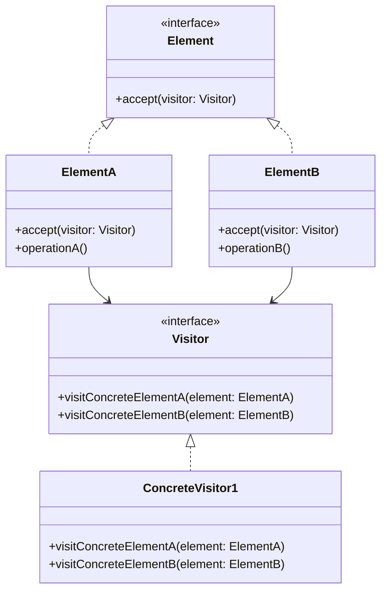

# 访问者模式 (Visitor Pattern)

## 概述
访问者模式是一种行为设计模式，它允许你在不改变已有类代码的情况下，向已有类层次结构中添加新的操作。它通过将算法与对象结构分离来实现这一目的。

## UML类图


## 代码示例
```typescript
interface Shape {
    accept(visitor: Visitor): void;
}

interface Visitor {
    visitCircle(circle: Circle): void;
    visitRectangle(rectangle: Rectangle): void;
}

class Circle implements Shape {
    constructor(public radius: number) {}
    
    accept(visitor: Visitor): void {
        visitor.visitCircle(this);
    }
}

class Rectangle implements Shape {
    constructor(
        public width: number,
        public height: number
    ) {}
    
    accept(visitor: Visitor): void {
        visitor.visitRectangle(this);
    }
}

class AreaCalculator implements Visitor {
    visitCircle(circle: Circle): void {
        const area = Math.PI * circle.radius ** 2;
        console.log(`Circle area: ${area}`);
    }
    
    visitRectangle(rectangle: Rectangle): void {
        const area = rectangle.width * rectangle.height;
        console.log(`Rectangle area: ${area}`);
    }
}

// 使用示例
const shapes: Shape[] = [
    new Circle(5),
    new Rectangle(4, 6)
];

const calculator = new AreaCalculator();
shapes.forEach(shape => shape.accept(calculator));
```

## 实现方式
1. 声明访问者接口
   - 为每个元素类型定义访问方法
   - 确保方法签名的正确性

2. 实现具体访问者
   - 实现每个访问方法
   - 封装相关算法
   - 维护必要的状态

## 使用场景
1. 对象结构稳定但操作多变
2. 需要对对象结构进行不同操作
3. 避免污染现有类的层次结构
4. 需要跨越不同类层次结构的操作

## 优缺点

### 优点
- 符合单一职责原则
- 支持双分派
- 易于添加新操作
- 集中相关操作

### 缺点
- 违反开闭原则
- 层次结构修改困难
- 增加系统复杂度

## 实际应用
1. AST处理
   - 编译器
   - 代码分析工具
   - XML解析器

2. 报表生成
   - 文档转换
   - 数据导出
   - 统计分析

3. GUI操作
   - 图形绘制
   - 事件处理
   - 界面更新

## 最佳实践
1. 慎重使用访问者模式
2. 保持元素接口稳定
3. 考虑使用组合模式
4. 注意访问者状态
5. 合理设计访问顺序

## 参考资料
1. [Design Patterns: Elements of Reusable Object-Oriented Software](https://book.douban.com/subject/1052241/)
2. [Head First Design Patterns](https://book.douban.com/subject/2243615/)
3. [Refactoring Guru: Visitor Pattern](https://refactoringguru.cn/design-patterns/visitor)
