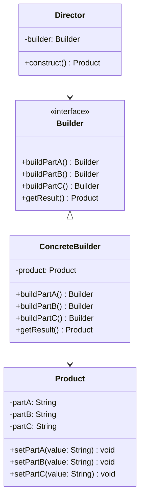

# 建造者模式 (Builder Pattern)

## 概述
建造者模式是一种创建型设计模式，它可以使用相同的创建代码生成不同类型和形式的对象。该模式特别适用于需要创建复杂对象的场景。

## UML类图


## 主要角色
1. Builder（抽象建造者）：定义创建产品各个部分的接口
2. ConcreteBuilder（具体建造者）：实现Builder接口，构建产品的各个部分
3. Director（指挥者）：构造一个使用Builder接口的对象
4. Product（产品）：被构造的复杂对象

## 代码示例
```java
// Product
class Computer {
    private String cpu;
    private String ram;
    private String storage;
    private String gpu;
    
    // getters and setters
    public void setCpu(String cpu) { this.cpu = cpu; }
    public void setRam(String ram) { this.ram = ram; }
    public void setStorage(String storage) { this.storage = storage; }
    public void setGpu(String gpu) { this.gpu = gpu; }
}

// Abstract Builder
interface ComputerBuilder {
    ComputerBuilder setCPU(String cpu);
    ComputerBuilder setRAM(String ram);
    ComputerBuilder setStorage(String storage);
    ComputerBuilder setGPU(String gpu);
    Computer build();
}

// Concrete Builder
class GamingComputerBuilder implements ComputerBuilder {
    private Computer computer = new Computer();
    
    @Override
    public ComputerBuilder setCPU(String cpu) {
        computer.setCpu(cpu);
        return this;
    }
    
    @Override
    public ComputerBuilder setRAM(String ram) {
        computer.setRam(ram);
        return this;
    }
    
    @Override
    public ComputerBuilder setStorage(String storage) {
        computer.setStorage(storage);
        return this;
    }
    
    @Override
    public ComputerBuilder setGPU(String gpu) {
        computer.setGpu(gpu);
        return this;
    }
    
    @Override
    public Computer build() {
        return computer;
    }
}

// Director
class ComputerAssembler {
    private ComputerBuilder builder;
    
    public ComputerAssembler(ComputerBuilder builder) {
        this.builder = builder;
    }
    
    public Computer constructGamingPC() {
        return builder.setCPU("Intel i9")
                     .setRAM("32GB")
                     .setStorage("2TB SSD")
                     .setGPU("RTX 3080")
                     .build();
    }
}
```

## 使用场景
1. 需要创建复杂对象的场景
2. 对象的创建过程需要更多的灵活性
3. 创建不同形式的产品
4. 需要细致控制构建过程
5. 构建过程中需要遵循特定的步骤或顺序

## 优缺点
### 优点
- 可以分步创建对象
- 支持构建过程复用
- 符合单一职责原则
- 提供更好的控制力

### 缺点
- 需要创建多个类
- 增加了代码复杂度
- 与其他创建型模式相比较为繁琐

## 实际应用
1. StringBuilder类
2. DocumentBuilder
3. Retrofit.Builder
4. AlertDialog.Builder
5. OkHttpClient.Builder

## 最佳实践
1. 使用链式调用
2. 考虑使用静态内部类Builder
3. 确保产品的不可变性
4. 处理必需参数和可选参数
5. 验证构建过程的完整性

## 参考资料
1. [设计模式：可复用面向对象软件的基础](https://book.douban.com/subject/1052241/)
2. [Head First 设计模式](https://book.douban.com/subject/2243615/)
3. [Effective Java - Builder Pattern](https://www.oreilly.com/library/view/effective-java-3rd/9780134686097/)