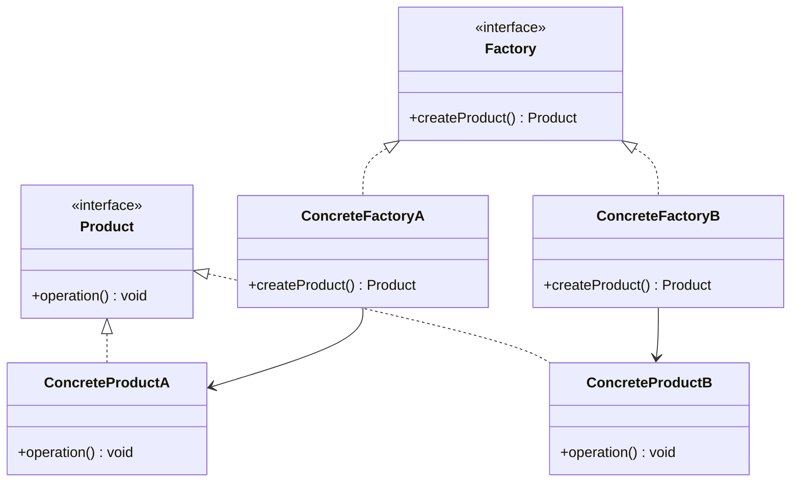

# 工厂模式 (Factory Pattern)

## 概述
工厂模式是一种创建型设计模式，它提供了一种将对象的实例化过程封装在工厂类中的方法。这种模式定义一个创建对象的接口，但由子类决定要实例化的类是哪一个。

## UML类图


## 代码示例
```java
// Product interface
interface Product {
    void operation();
}

// Concrete products
class ConcreteProductA implements Product {
    @Override
    public void operation() {
        System.out.println("ConcreteProductA operation");
    }
}

class ConcreteProductB implements Product {
    @Override
    public void operation() {
        System.out.println("ConcreteProductB operation");
    }
}

// Factory interface
interface Factory {
    Product createProduct();
}

// Concrete factories
class ConcreteFactoryA implements Factory {
    @Override
    public Product createProduct() {
        return new ConcreteProductA();
    }
}

class ConcreteFactoryB implements Factory {
    @Override
    public Product createProduct() {
        return new ConcreteProductB();
    }
}
```

## 使用场景
1. 不确定要创建的对象具体类时
2. 类将来可能需要扩展
3. 需要解耦对象的创建和使用
4. 想要复用已有的对象

## 优缺点
### 优点
- 遵循单一职责原则
- 遵循开闭原则
- 封装了对象创建逻辑
- 降低了代码耦合度

### 缺点
- 需要创建许多新的类
- 增加了代码复杂度
- 可能会导致类层次结构复杂

## 实现方式
1. 简单工厂
2. 工厂方法
3. 抽象工厂
4. 静态工厂方法

## 最佳实践
1. 合理使用工厂模式
2. 注意类的命名规范
3. 考虑使用单例模式
4. 处理异常情况
5. 注意扩展性设计

## 实际应用
1. Collection.iterator()
2. Calendar.getInstance()
3. NumberFormat.getInstance()
4. ResourceBundle.getBundle()

## 参考资料
1. [Design Patterns: Elements of Reusable Object-Oriented Software](https://book.douban.com/subject/1052241/)
2. [Head First Design Patterns](https://book.douban.com/subject/2243615/)
3. [Effective Java](https://www.oreilly.com/library/view/effective-java-3rd/9780134686097/)