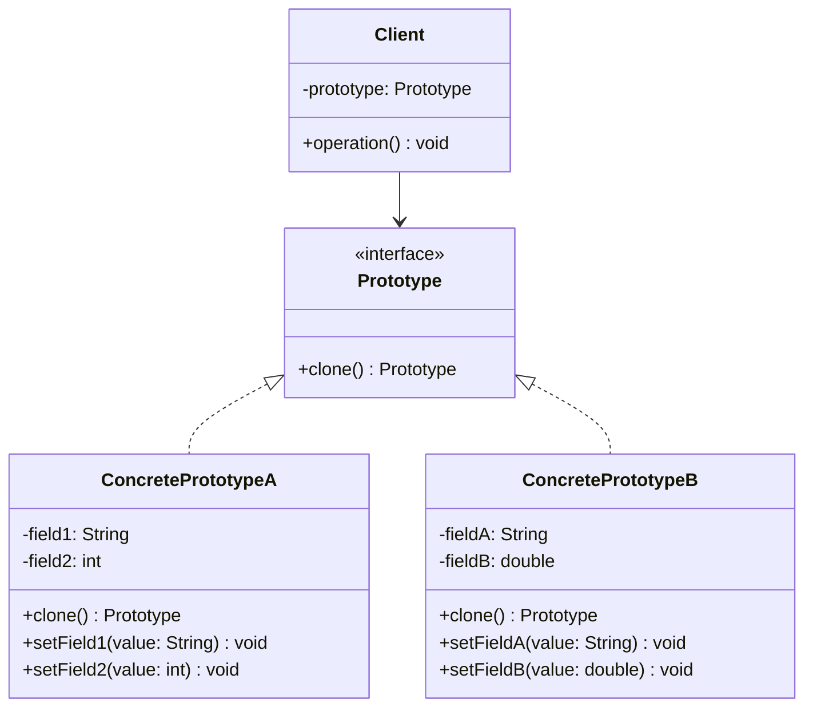

# 原型模式 (Prototype Pattern)

## 概述
原型模式是一种创建型设计模式，它允许通过复制现有对象来创建新对象，而不是通过实例化类来创建。这种方式可以避免创建子类，并且可以减少系统的耦合度。

## UML类图


## 代码示例
```java
// Prototype interface
public interface Prototype extends Cloneable {
    Prototype clone();
}

// Concrete prototype
public class ConcretePrototype implements Prototype {
    private String field;
    
    public ConcretePrototype(String field) {
        this.field = field;
    }
    
    @Override
    public Prototype clone() {
        try {
            return (Prototype) super.clone();
        } catch (CloneNotSupportedException e) {
            return null;
        }
    }
}

// Client code
public class Client {
    public static void main(String[] args) {
        ConcretePrototype prototype = new ConcretePrototype("test");
        ConcretePrototype clone = (ConcretePrototype) prototype.clone();
    }
}
```

## 实现方式
1. 浅克隆
   - 复制对象的基本类型字段
   - 复制对象引用
2. 深克隆
   - 复制对象的基本类型字段
   - 创建引用对象的新实例

## 使用场景
1. 创建对象的成本较大
2. 对象结构比较复杂
3. 需要保存对象的状态
4. 需要避免重复创建相似对象

## 优缺点
### 优点
- 减少子类的创建
- 动态添加或删除产品
- 改变值域时不会影响原型
- 提高性能

### 缺点
- 克隆包含循环引用的复杂对象可能会很困难
- 深克隆的实现较为复杂
- 每个原型子类都必须实现clone方法

## 最佳实践
1. 实现Cloneable接口
2. 重写Object.clone()方法
3. 注意深浅克隆的选择
4. 处理克隆失败的异常
5. 考虑使用序列化实现深克隆

## 相关模式
1. 抽象工厂模式
2. 组合模式
3. 装饰器模式

## 参考资料
1. [Design Patterns: Elements of Reusable Object-Oriented Software](https://book.douban.com/subject/1052241/)
2. [Head First Design Patterns](https://book.douban.com/subject/2243615/)
3. [Effective Java - Object Creation and Destruction](https://www.oreilly.com/library/view/effective-java-3rd/9780134686097/)