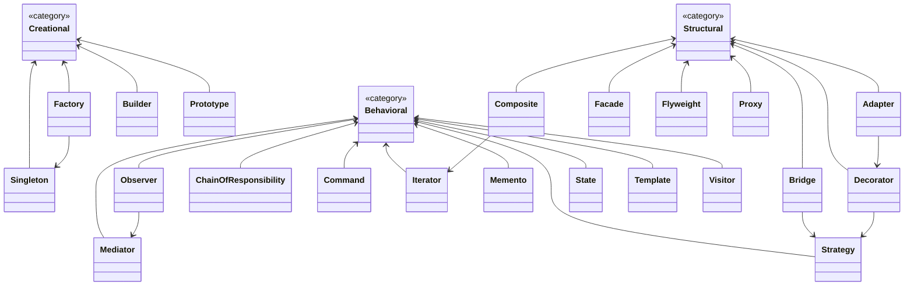

# 设计模式概览

## 设计模式之间的关系

## 创建型模式
创建型模式提供了创建对象的机制，可以提高已有代码的灵活性和可复用性。

- [工厂方法模式](/design_pattern/creational/factory.md)
- [抽象工厂模式](/design_pattern/creational/abstract_factory.md)
- [建造者模式](/design_pattern/creational/builder.md)
- [原型模式](/design_pattern/creational/prototype.md)
- [单例模式](/design_pattern/creational/singleton.md)

## 结构型模式
结构型模式介绍如何将对象和类组装成较大的结构，并同时保持结构的灵活和高效。

- [适配器模式](/design_pattern/structural/adapter.md)
- [桥接模式](/design_pattern/structural/bridge.md)
- [组合模式](/design_pattern/structural/composite.md)
- [装饰器模式](/design_pattern/structural/decorator.md)
- [外观模式](/design_pattern/structural/facade.md)
- [享元模式](/design_pattern/structural/flyweight.md)
- [代理模式](/design_pattern/structural/proxy.md)

## 行为型模式
行为模式负责对象间的高效通信和职责委派。

- [责任链模式](/design_pattern/behavioral/chain_of_responsibility.md)
- [命令模式](/design_pattern/behavioral/command.md)
- [迭代器模式](/design_pattern/behavioral/iterator.md)
- [中介者模式](/design_pattern/behavioral/mediator.md)
- [备忘录模式](/design_pattern/behavioral/memento.md)
- [观察者模式](/design_pattern/behavioral/observer.md)
- [状态模式](/design_pattern/behavioral/state.md)
- [策略模式](/design_pattern/behavioral/strategy.md)
- [模板方法模式](/design_pattern/behavioral/template.md)
- [访问者模式](/design_pattern/behavioral/visitor.md)

## 设计模式的关键原则
- 单一职责原则（Single Responsibility Principle）
- 开闭原则（Open/Closed Principle）
- 里氏替换原则（Liskov Substitution Principle）
- 接口隔离原则（Interface Segregation Principle）
- 依赖倒置原则（Dependency Inversion Principle）

## 如何选择设计模式
1. **创建型模式**：当系统需要解耦对象的创建与使用时
2. **结构型模式**：当需要组织类或对象形成更大的结构时
3. **行为型模式**：当对象之间的交互和职责分配需要更灵活时

## 参考资料
1. [Design Patterns: Elements of Reusable Object-Oriented Software](https://book.douban.com/subject/1052241/)
2. [Head First Design Patterns](https://book.douban.com/subject/2243615/)
3. [Refactoring Guru: Design Patterns](https://refactoringguru.cn/design-patterns)
