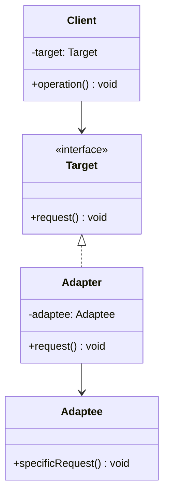

# 适配器模式 (Adapter Pattern)

## 概述
适配器模式是一种结构型设计模式，它允许将一个类的接口转换成客户端所期望的另一个接口。适配器让那些接口不兼容的类可以一起工作。

## UML类图


## 代码示例
```java
// Target interface
interface Target {
    void request();
}

// Adaptee (legacy code)
class Adaptee {
    void specificRequest() {
        System.out.println("Specific request from Adaptee");
    }
}

// Object Adapter
class Adapter implements Target {
    private Adaptee adaptee;
    
    public Adapter(Adaptee adaptee) {
        this.adaptee = adaptee;
    }
    
    @Override
    public void request() {
        adaptee.specificRequest();
    }
}

// Client
class Client {
    private Target target;
    
    public Client(Target target) {
        this.target = target;
    }
    
    public void execute() {
        target.request();
    }
}
```

## 实现方式
1. 类适配器（使用继承）
   - 通过继承适配者类实现
   - 仅能适配一个类
   - Java中使用多重继承受限

2. 对象适配器（使用组合）
   - 通过组合方式实现
   - 可以适配多个类
   - 更加灵活，推荐使用

## 使用场景
1. 需要复用现有类，但接口不兼容
2. 需要统一多个类的接口
3. 需要适配第三方库
4. 集成遗留系统

## 优缺点
### 优点
- 将接口转换与业务逻辑分离
- 提高代码复用性
- 符合单一职责原则
- 增加类的透明性

### 缺点
- 增加系统复杂度
- 可能需要更多的代码
- 过度使用可能使系统难以理解

## 实际应用
1. Java IO
   - InputStreamReader（字节流到字符流的适配）
   - OutputStreamWriter（字符流到字节流的适配）
2. Collections Framework
   - Arrays.asList()
   - Collections.list()
3. Spring Framework
   - HandlerAdapter
   - WebMvcAdapter

## 最佳实践
1. 优先使用对象适配器而非类适配器
2. 保持接口的简单性
3. 明确命名规范（通常以Adapter结尾）
4. 考虑使用工厂模式创建适配器
5. 注意异常处理和资源释放

## 参考资料
1. [Design Patterns: Elements of Reusable Object-Oriented Software](https://book.douban.com/subject/1052241/)
2. [Head First Design Patterns](https://book.douban.com/subject/2243615/)
3. [Java设计模式：适配器模式](https://refactoringguru.cn/design-patterns/adapter)