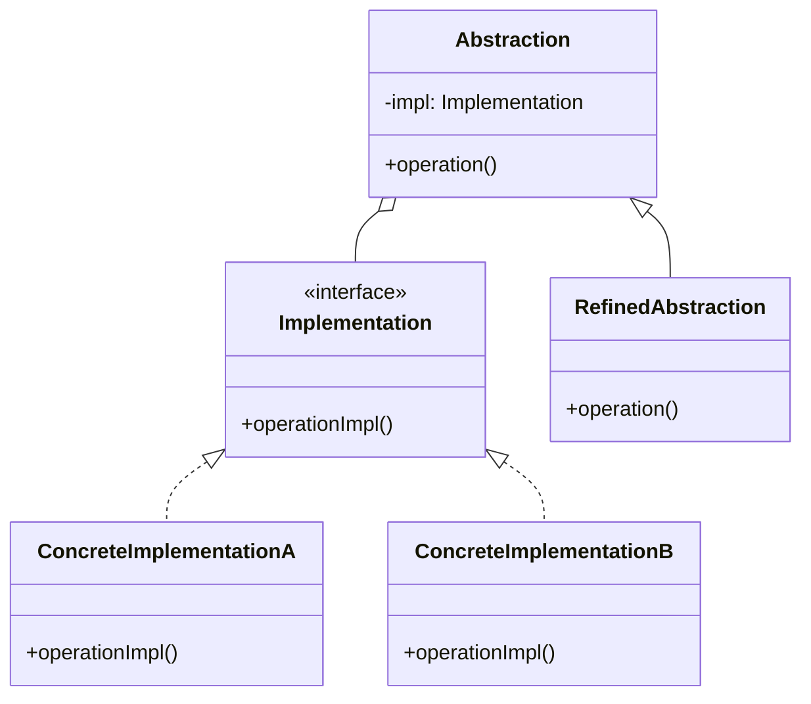

# 桥接模式 (Bridge Pattern)

## 概述
桥接模式是一种结构型设计模式，它将抽象部分与实现部分分离，使它们可以独立变化。通过组合替代继承来解决类爆炸问题。

## UML类图


## 实现方式
1. 识别类中的维度
   - 确定独立变化的两个维度
   - 提取抽象和实现层次结构

2. 建立桥接关系
   - 在抽象类中引用实现接口
   - 通过组合方式建立关系
   - 确保可以动态替换实现

## 使用场景
1. 需要跨平台的应用程序
2. 需要在运行时切换实现的场景
3. 存在多个维度变化的系统
4. 避免类爆炸的情况

## 优缺点

### 优点
- 分离抽象和实现，实现松耦合
- 提高代码可扩展性
- 实现细节对客户端透明
- 遵循开闭原则，易于添加新的抽象和实现

### 缺点
- 增加了系统的复杂度
- 需要正确识别系统中的两个独立变化的维度

## 实际应用
1. GUI框架
   - 窗口系统与平台实现分离
   - AWT的 `Platform-Independent` 架构

2. JDBC
   - Connection接口与具体数据库驱动
   - DriverManager桥接模式

3. 日志框架
   - SLF4J的API与具体实现分离
   - Log4j和Logback的适配

## 最佳实践
1. 优先考虑组合而非继承
2. 提前识别变化的维度
3. 保持抽象和实现的独立性
4. 使用依赖注入管理实现
5. 考虑使用工厂方法创建实现对象

## 代码示例
```typescript
// 简化的设备-遥控器示例
interface Device {
    isEnabled(): boolean;
    enable(): void;
    disable(): void;
    getVolume(): number;
    setVolume(percent: number): void;
}

abstract class RemoteControl {
    protected device: Device;
    
    constructor(device: Device) {
        this.device = device;
    }
    
    togglePower(): void {
        if (this.device.isEnabled()) {
            this.device.disable();
        } else {
            this.device.enable();
        }
    }
    
    volumeUp(): void {
        this.device.setVolume(this.device.getVolume() + 10);
    }
}

// 使用示例
const tv = new TV();
const remote = new BasicRemote(tv);
remote.togglePower();
```

## 参考资料
1. [Design Patterns: Elements of Reusable Object-Oriented Software](https://book.douban.com/subject/1052241/)
2. [Head First Design Patterns](https://book.douban.com/subject/2243615/)
3. [Refactoring Guru: Bridge Pattern](https://refactoringguru.cn/design-patterns/bridge)
