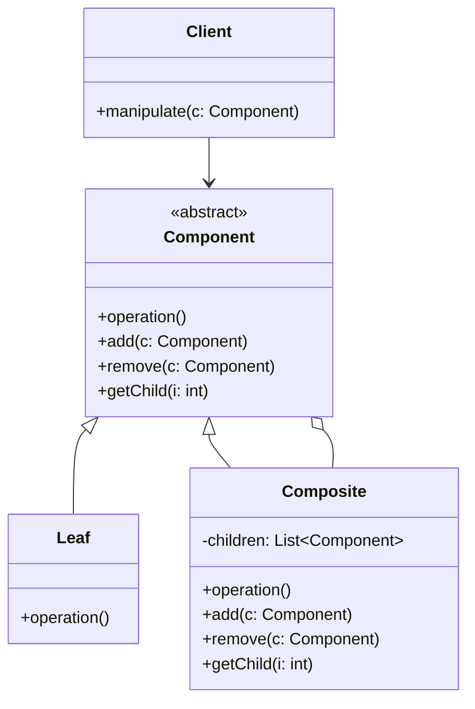

# 组合模式 (Composite Pattern)

## 概述
组合模式是一种结构型设计模式，它允许将对象组织成树形结构来表示"部分-整体"的层次关系。组合模式让客户端可以统一对待单个对象和对象组合。

## UML类图


## 代码示例
```typescript
abstract class FileSystemComponent {
    protected name: string;
    
    constructor(name: string) {
        this.name = name;
    }
    
    abstract getSize(): number;
    abstract display(indent: string): void;
}

class File extends FileSystemComponent {
    private size: number;
    
    constructor(name: string, size: number) {
        super(name);
        this.size = size;
    }
    
    getSize(): number {
        return this.size;
    }
    
    display(indent: string): void {
        console.log(`${indent}- ${this.name} (${this.size}bytes)`);
    }
}

class Directory extends FileSystemComponent {
    private children: FileSystemComponent[] = [];
    
    add(component: FileSystemComponent): void {
        this.children.push(component);
    }
    
    getSize(): number {
        return this.children.reduce((sum, child) => sum + child.getSize(), 0);
    }
    
    display(indent: string): void {
        console.log(`${indent}+ ${this.name}/`);
        this.children.forEach(child => child.display(indent + "  "));
    }
}

// 使用示例
const root = new Directory("root");
const docs = new Directory("docs");
const file1 = new File("note.txt", 100);
const file2 = new File("image.jpg", 2000);

root.add(docs);
docs.add(file1);
docs.add(file2);

root.display("");  // 显示整个文件结构
console.log(`Total size: ${root.getSize()}bytes`);
```

## 实现方式
1. 确定组件接口
   - 定义公共操作方法
   - 设计组合管理方法
   - 考虑安全性和透明性

2. 实现叶子节点
   - 实现具体业务逻辑
   - 处理不支持的操作

3. 实现组合节点
   - 管理子节点集合
   - 递归处理组合操作
   - 实现组件接口

## 使用场景
1. 表示对象的部分-整体层次结构
2. 统一处理简单和复杂对象
3. 构建树形结构数据
4. 需要递归处理对象结构

## 优缺点

### 优点
- 简化客户端代码
- 方便添加新类型组件
- 提供统一的接口
- 符合开闭原则

### 缺点
- 难以限制组件的类型
- 可能使设计变得过于一般化
- 可能违反单一职责原则

## 实际应用
1. 文件系统
   - 目录和文件的管理
   - 权限和大小计算

2. GUI框架
   - Swing/AWT的组件体系
   - DOM树结构

3. 菜单系统
   - 多级菜单
   - 权限管理

## 最佳实践
1. 清晰定义组件接口
2. 注意组合的递归终止条件
3. 考虑使用缓存优化性能
4. 处理好异常情况
5. 注意组件的生命周期管理

## 参考资料
1. [Design Patterns: Elements of Reusable Object-Oriented Software](https://book.douban.com/subject/1052241/)
2. [Head First Design Patterns](https://book.douban.com/subject/2243615/)
3. [Refactoring Guru: Composite Pattern](https://refactoringguru.cn/design-patterns/composite)
