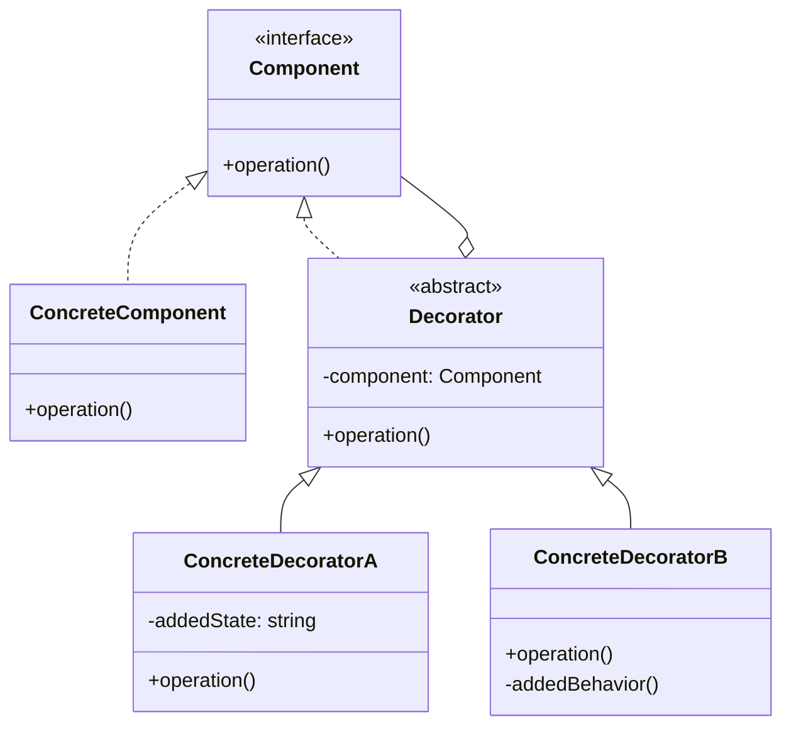

# 装饰器模式 (Decorator Pattern)

## 概述
装饰器模式是一种结构型设计模式，它允许通过将对象放入包含行为的特殊封装对象中来为原对象动态添加新的行为。

## UML类图


## 代码示例
```typescript
interface Coffee {
    cost(): number;
    description(): string;
}

class SimpleCoffee implements Coffee {
    cost(): number {
        return 10;
    }
    
    description(): string {
        return "Simple coffee";
    }
}

abstract class CoffeeDecorator implements Coffee {
    protected coffee: Coffee;
    
    constructor(coffee: Coffee) {
        this.coffee = coffee;
    }
    
    cost(): number {
        return this.coffee.cost();
    }
    
    description(): string {
        return this.coffee.description();
    }
}

class MilkDecorator extends CoffeeDecorator {
    cost(): number {
        return this.coffee.cost() + 2;
    }
    
    description(): string {
        return this.coffee.description() + ", milk";
    }
}

// 使用示例
const coffee = new SimpleCoffee();
const coffeeWithMilk = new MilkDecorator(coffee);
console.log(coffeeWithMilk.description()); // "Simple coffee, milk"
console.log(coffeeWithMilk.cost());        // 12
```

## 实现方式
1. 确保有一个核心组件
   - 定义主要接口
   - 实现基础功能

2. 创建装饰器基类
   - 实现与组件相同的接口
   - 包含对组件的引用
   - 定义转发方法

3. 创建具体装饰器
   - 扩展装饰器基类
   - 添加新的行为
   - 重写必要的方法

## 使用场景
1. 需要动态添加职责
2. 不适合使用继承的场景
3. 需要运行时组合行为
4. 需要保持单一职责原则

## 优缺点

### 优点
- 比继承更灵活
- 支持动态添加/删除职责
- 遵循单一职责原则
- 无需修改现有代码

### 缺点
- 代码可能变得复杂
- 装饰器顺序可能影响结果
- 初始化配置繁琐

## 实际应用
1. Java I/O 流
   - BufferedInputStream
   - DataInputStream
   - FileInputStream

2. Web开发
   - HTTP请求装饰器
   - 响应装饰器
   - 中间件机制

3. GUI组件
   - 滚动条装饰
   - 边框装饰
   - 主题装饰

## 最佳实践
1. 保持装饰器轻量
2. 注意装饰顺序
3. 考虑使用工厂模式创建装饰器
4. 文档说明装饰器的作用
5. 避免过度装饰

## 参考资料
1. [Design Patterns: Elements of Reusable Object-Oriented Software](https://book.douban.com/subject/1052241/)
2. [Head First Design Patterns](https://book.douban.com/subject/2243615/)
3. [Refactoring Guru: Decorator Pattern](https://refactoringguru.cn/design-patterns/decorator)
