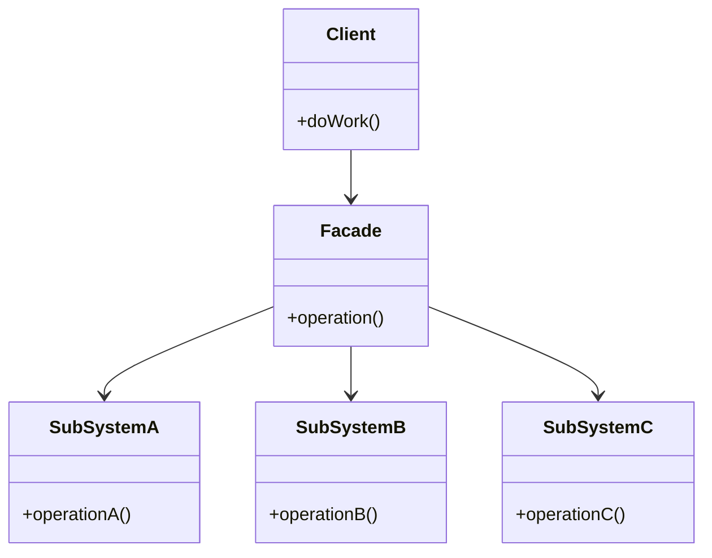

# 外观模式 (Facade Pattern)

## 概述
外观模式是一种结构型设计模式，它提供了一个统一的接口，用来访问子系统中的一组接口。外观为复杂子系统定义了一个简单的高层接口，使得子系统更容易使用。

## UML类图


## 代码示例
```typescript
// 子系统组件
class DVDPlayer {
    turnOn(): void {
        console.log("DVD Player is on");
    }
    
    play(movie: string): void {
        console.log(`Playing ${movie}`);
    }
}

class Amplifier {
    turnOn(): void {
        console.log("Amp is on");
    }
    
    setVolume(level: number): void {
        console.log(`Setting volume to ${level}`);
    }
}

class Projector {
    turnOn(): void {
        console.log("Projector is on");
    }
    
    setInput(input: string): void {
        console.log(`Setting input to ${input}`);
    }
}

// 外观类
class HomeTheaterFacade {
    private dvd: DVDPlayer;
    private amp: Amplifier;
    private projector: Projector;
    
    constructor() {
        this.dvd = new DVDPlayer();
        this.amp = new Amplifier();
        this.projector = new Projector();
    }
    
    watchMovie(movie: string): void {
        console.log("Get ready to watch a movie...");
        this.amp.turnOn();
        this.amp.setVolume(5);
        this.projector.turnOn();
        this.projector.setInput("DVD");
        this.dvd.turnOn();
        this.dvd.play(movie);
    }
}

// 使用示例
const homeTheater = new HomeTheaterFacade();
homeTheater.watchMovie("The Matrix");
```

## 实现方式
1. 创建外观类
   - 识别子系统组件
   - 设计简化接口
   - 封装复杂交互

2. 整合子系统
   - 组合必要的子系统
   - 定义协作方式
   - 处理依赖关系

## 使用场景
1. 需要简化复杂系统的接口
2. 需要将系统分层
3. 需要为复杂子系统提供入口点
4. 需要解耦子系统与客户端

## 优缺点

### 优点
- 简化客户端调用
- 降低系统耦合度
- 提供统一的接口
- 隐藏系统复杂性

### 缺点
- 可能成为神类
- 不符合开闭原则
- 可能增加系统维护难度

## 实际应用
1. 抽象工厂
   - Spring FactoryBean
   - EntityManagerFactory

2. Web开发
   - 服务门面
   - Controller层
   - API网关

3. 框架API
   - jQuery
   - SLF4J
   - 工具类库

## 最佳实践
1. 保持外观接口简单
2. 避免过度封装
3. 考虑使用多个外观
4. 正确处理异常传递
5. 合理划分责任边界

## 参考资料
1. [Design Patterns: Elements of Reusable Object-Oriented Software](https://book.douban.com/subject/1052241/)
2. [Head First Design Patterns](https://book.douban.com/subject/2243615/)
3. [Refactoring Guru: Facade Pattern](https://refactoringguru.cn/design-patterns/facade)
