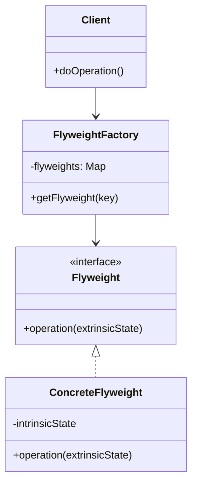

# 享元模式 (Flyweight Pattern)

## 概述
享元模式是一种结构型设计模式，它通过共享来有效地支持大量细粒度对象。通过共享相同的对象，减少内存使用和对象创建的开销。

## UML类图


## 代码示例
```typescript
// 享元接口
interface Character {
    display(position: number): void;
}

// 具体享元类
class CharacterA implements Character {
    private symbol: string;
    // 内部状态 - 共享
    constructor() {
        this.symbol = 'A';
    }
    
    // 外部状态作为参数传入
    display(position: number): void {
        console.log(`Character ${this.symbol} at position ${position}`);
    }
}

// 享元工厂
class CharacterFactory {
    private characters: Map<string, Character> = new Map();
    
    getCharacter(char: string): Character {
        if (!this.characters.has(char)) {
            this.characters.set(char, new CharacterA());
        }
        return this.characters.get(char)!;
    }
}

// 使用示例
const factory = new CharacterFactory();
const charA1 = factory.getCharacter('A');
const charA2 = factory.getCharacter('A');

charA1.display(1); // 使用不同的外部状态
charA2.display(2); // 共享相同的对象
```

## 实现方式
1. 区分内部状态和外部状态
   - 内部状态：可共享的信息
   - 外部状态：对象特有的信息
   
2. 创建享元工厂
   - 管理享元对象池
   - 确保对象共享
   - 处理对象创建

## 使用场景
1. 系统中有大量相似对象
2. 对象的大部分状态都可以外部化
3. 需要控制内存消耗
4. 对象的身份不重要

## 优缺点

### 优点
- 减少内存使用
- 提高性能
- 集中管理共享对象
- 适合处理大量细粒度对象

### 缺点
- 增加系统复杂度
- 需要区分内外部状态
- 可能引入线程安全问题

## 实际应用
1. 字符串常量池
   - Java String Pool
   - .NET String Interning

2. 数据库连接池
   - JDBC Connection Pool
   - C3P0, Druid

3. 图形界面
   - 文字渲染
   - 图形缓存
   - 共享图标资源

## 最佳实践
1. 正确识别共享元素
2. 注意线程安全
3. 合理使用工厂模式
4. 避免过度使用
5. 考虑缓存策略

## 参考资料
1. [Design Patterns: Elements of Reusable Object-Oriented Software](https://book.douban.com/subject/1052241/)
2. [Head First Design Patterns](https://book.douban.com/subject/2243615/)
3. [Refactoring Guru: Flyweight Pattern](https://refactoringguru.cn/design-patterns/flyweight)
