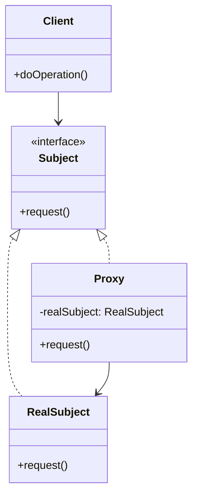

# 代理模式 (Proxy Pattern)

## 概述
代理模式是一种结构型设计模式，它为其他对象提供一个代理以控制对这个对象的访问。代理对象在客户端和目标对象之间起到中介的作用，并可以添加额外的功能。

## UML类图


## 代码示例
```typescript
// 主题接口
interface Image {
    display(): void;
}

// 实际主题
class RealImage implements Image {
    private filename: string;
    
    constructor(filename: string) {
        this.filename = filename;
        this.loadFromDisk();
    }
    
    private loadFromDisk(): void {
        console.log(`Loading ${this.filename}`);
    }
    
    display(): void {
        console.log(`Displaying ${this.filename}`);
    }
}

// 代理类
class ProxyImage implements Image {
    private realImage: RealImage | null = null;
    private filename: string;
    
    constructor(filename: string) {
        this.filename = filename;
    }
    
    display(): void {
        if (this.realImage === null) {
            this.realImage = new RealImage(this.filename);
        }
        this.realImage.display();
    }
}

// 使用示例
const image = new ProxyImage("test.jpg");
// 图像将在首次调用时加载
image.display();
// 图像不会再次加载
image.display();
```

## 实现方式
1. 创建接口
   - 定义公共操作方法
   - 确保代理和实际对象实现相同接口

2. 实现代理类
   - 引用实际对象
   - 控制访问
   - 添加额外功能

## 使用场景
1. 延迟加载（虚拟代理）
2. 访问控制（保护代理）
3. 日志记录（日志代理）
4. 缓存（缓存代理）
5. 远程调用（远程代理）

## 优缺点

### 优点
- 控制对对象的访问
- 延迟初始化
- 实现透明访问
- 提供额外功能

### 缺点
- 增加系统复杂度
- 可能影响响应时间
- 可能导致请求的处理速度变慢

## 实际应用
1. Spring AOP
   - 事务管理
   - 权限控制
   - 日志记录

2. Java动态代理
   - RMI
   - JDK动态代理
   - CGLIB代理

3. 前端开发
   - 图片懒加载
   - 数据缓存
   - API代理

## 最佳实践
1. 选择合适的代理类型
2. 注意性能影响
3. 避免代理链过长
4. 合理使用缓存
5. 正确处理异常

## 参考资料
1. [Design Patterns: Elements of Reusable Object-Oriented Software](https://book.douban.com/subject/1052241/)
2. [Head First Design Patterns](https://book.douban.com/subject/2243615/)
3. [Refactoring Guru: Proxy Pattern](https://refactoringguru.cn/design-patterns/proxy)
