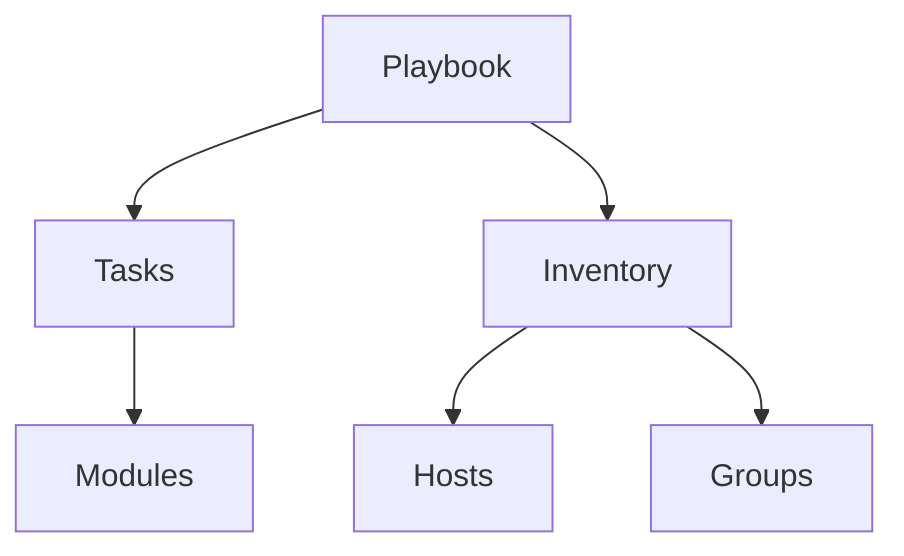

# Ansible 自动化工具

## 概述
Ansible 是一个开源的自动化工具，用于配置管理、应用部署、任务自动化等IT运维工作。

## 核心概念


## 配置示例
```yaml
# inventory.yml
webservers:
  hosts:
    web1.example.com:
      http_port: 80
    web2.example.com:
      http_port: 8080
  vars:
    ansible_user: admin

# playbook.yml
---
- name: Configure web servers
  hosts: webservers
  become: yes
  tasks:
    - name: Install nginx
      apt:
        name: nginx
        state: present
    
    - name: Start nginx service
      service:
        name: nginx
        state: started
```

## 主要功能
1. 配置管理
2. 应用部署
3. 任务编排
4. 安全加固

## 最佳实践
1. Inventory管理
   - 主机分组
   - 变量管理
   - 动态inventory

2. Playbook设计
   - 模块化
   - 角色封装
   - 变量使用

3. 安全实践
   - SSH密钥管理
   - 权限控制
   - Vault加密

## 常用模块
1. 系统模块
   - apt/yum
   - service
   - user/group

2. 文件操作
   - copy
   - template
   - file

3. 命令执行
   - shell
   - command
   - script

## 参考资料
1. [Ansible Documentation](https://docs.ansible.com/)
2. [Ansible Best Practices](https://docs.ansible.com/ansible/latest/user_guide/playbooks_best_practices.html)
3. [Ansible Examples](https://github.com/ansible/ansible-examples)
