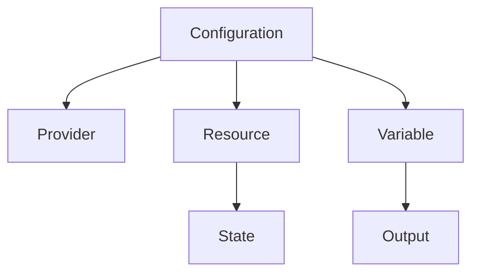

# Terraform 基础设施即代码

## 概述
Terraform 是一个开源的基础设施即代码（Infrastructure as Code）工具，用于安全高效地构建、更改和管理基础设施。

## 核心概念


## 配置示例
```hcl
# Provider配置
provider "aws" {
  region = "us-west-2"
}

# 资源定义
resource "aws_instance" "web" {
  ami           = "ami-0c55b159cbfafe1f0"
  instance_type = "t2.micro"

  tags = {
    Name = "web-server"
  }
}

# 变量定义
variable "environment" {
  description = "Environment name"
  type        = string
  default     = "development"
}

# 输出定义
output "instance_ip" {
  value = aws_instance.web.public_ip
}
```

## 主要功能
1. 基础设施管理
   - 资源创建
   - 资源更新
   - 资源删除

2. 状态管理
   - 本地状态
   - 远程状态
   - 状态锁定

3. 模块化
   - 代码复用
   - 版本控制
   - 依赖管理

## 工作流程
1. 初始化
   ```bash
   terraform init
   ```

2. 规划
   ```bash
   terraform plan
   ```

3. 应用
   ```bash
   terraform apply
   ```

## 最佳实践
1. 代码组织
   - 模块化设计
   - 工作空间管理
   - 版本控制

2. 安全考虑
   - 访问控制
   - 密钥管理
   - 状态加密

3. 协作管理
   - 远程状态
   - 状态锁定
   - 团队工作流

## 常见问题
1. 状态管理
   - 状态丢失
   - 状态不同步
   - 并发访问

2. 性能问题
   - 大规模部署
   - 依赖关系
   - 资源限制

## 参考资料
1. [Terraform Documentation](https://www.terraform.io/docs)
2. [Terraform Best Practices](https://www.terraform-best-practices.com/)
3. [HashiCorp Learn](https://learn.hashicorp.com/terraform)
