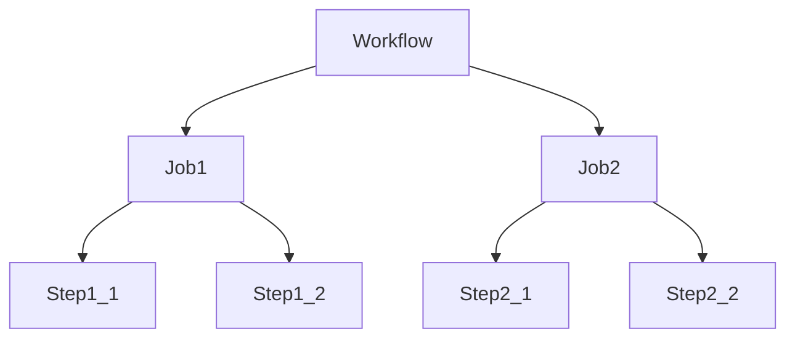

# GitHub Actions & CI/CD

## 概述
GitHub Actions 是一个持续集成和持续交付(CI/CD)平台，它可以自动化构建、测试和部署流程。

## 基本概念


### Workflow（工作流）
- 可配置的自动化流程
- 由一个或多个作业组成
- 由事件触发
- 使用YAML语法定义

### Job（作业）
- 在同一运行器上执行的一组步骤
- 可以并行或串行运行
- 可以设置依赖关系

### Step（步骤）
- 可以运行命令或动作
- 共享同一运行器的资源
- 可以访问工作区文件

### Matrix（矩阵）
- 使用不同配置运行作业
- 支持多个维度组合
- 常用于多版本测试
- 可以排除特定组合

示例：
```yaml
strategy:
  matrix:
    node-version: [12.x, 14.x, 16.x]
    os: [ubuntu-latest, windows-latest]
    exclude:
      - os: windows-latest
        node-version: 12.x
```

## 配置示例
```yaml
name: CI/CD Pipeline

on:
  push:
    branches: [ main ]
  pull_request:
    branches: [ main ]

jobs:
  test:
    runs-on: ubuntu-latest
    strategy:
      matrix:
        node-version: [14.x, 16.x]
    
    steps:
    - uses: actions/checkout@v2
    
    - name: Setup Node.js ${{ matrix.node-version }}
      uses: actions/setup-node@v2
      with:
        node-version: ${{ matrix.node-version }}
        
    - name: Install dependencies
      run: npm install
      
    - name: Run tests
      run: npm test

  deploy:
    needs: test
    runs-on: ubuntu-latest
    if: github.ref == 'refs/heads/main'
    
    steps:
    - uses: actions/checkout@v2
    
    - name: Login to Docker Hub
      uses: docker/login-action@v1
      with:
        username: ${{ secrets.DOCKER_USERNAME }}
        password: ${{ secrets.DOCKER_PASSWORD }}
    
    - name: Build and push Docker image
      uses: docker/build-push-action@v2
      with:
        push: true
        tags: user/app:latest
    
    - name: Deploy to remote server
      uses: appleboy/ssh-action@master
      with:
        host: ${{ secrets.SERVER_HOST }}
        username: ${{ secrets.SERVER_USER }}
        key: ${{ secrets.SSH_PRIVATE_KEY }}
        script: |
          docker pull user/app:latest
          docker stop app-container || true
          docker rm app-container || true
          docker run -d --name app-container -p 3000:3000 user/app:latest
```

## 常用功能

### 环境变量
- GitHub内置变量
- 仓库级别密钥
- 环境级别密钥
- 工作流级别变量

### Runners（运行器）
1. GitHub托管运行器
   - Ubuntu
   - Windows
   - macOS

2. 自托管运行器
   - 自定义环境
   - 特殊硬件需求
   - 安全要求

### Actions（动作）
- 官方动作
- 社区动作
- 自定义动作

## 最佳实践
1. 工作流设计
   - 保持工作流简单
   - 适当使用缓存
   - 合理设置触发条件

2. 安全考虑
   - 使用密钥管理敏感信息
   - 限制权限范围
   - 定期更新依赖

3. 性能优化
   - 并行执行作业
   - 使用矩阵构建
   - 复用工作流

## 常见场景
1. 自动化测试
   - 单元测试
   - 集成测试
   - 代码覆盖率

2. 部署流程
   - 开发环境
   - 测试环境
   - 生产环境

3. 代码质量
   - 代码检查
   - 依赖扫描
   - 安全审计

## 故障排除
1. 常见问题
   - 构建失败
   - 权限问题
   - 超时问题

2. 调试方法
   - 查看日志
   - 使用调试日志
   - 本地测试工作流

## 参考资料
1. [GitHub Actions Documentation](https://docs.github.com/en/actions)
2. [GitHub Actions Marketplace](https://github.com/marketplace?type=actions)
3. [GitHub Actions Community Forum](https://github.community/c/github-actions)
