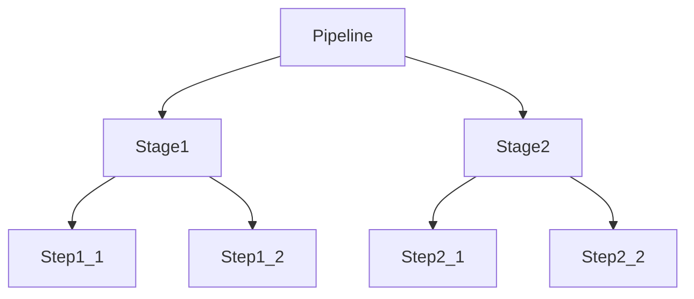

# Jenkins CI/CD

## 概述
Jenkins 是一个开源的自动化服务器，提供了数百个插件来支持构建、部署和自动化任何项目。

## 基本概念


### Pipeline（流水线）
- 用代码定义的交付流水线
- 支持并行执行
- 可持久化和可恢复
- 支持分支和变量

### Stage（阶段）
- 定义概念上不同的任务集合
- 可视化CI/CD的进度
- 包含多个Step
- 支持条件执行

### Step（步骤）
- 单一的任务
- 告诉Jenkins具体做什么
- 由插件提供功能
- 支持脚本化操作

## Jenkinsfile示例
```groovy
pipeline {
    agent any
    
    environment {
        DOCKER_REGISTRY = 'registry.example.com'
    }
    
    stages {
        stage('Build') {
            steps {
                sh 'npm install'
                sh 'npm run build'
            }
        }
        
        stage('Test') {
            steps {
                sh 'npm test'
            }
            post {
                always {
                    junit 'test-results/*.xml'
                }
            }
        }
        
        stage('Deploy') {
            when {
                branch 'main'
            }
            steps {
                sh """
                    docker build -t ${DOCKER_REGISTRY}/app:${BUILD_NUMBER} .
                    docker push ${DOCKER_REGISTRY}/app:${BUILD_NUMBER}
                """
            }
        }
    }
}
```

## 核心功能

### 构建触发器
- SCM轮询
- Webhook触发
- 定时构建
- 上游任务触发

### 构建环境
- 工作空间管理
- 环境变量
- 凭据管理
- 工具安装

### 插件系统
- 源码管理
- 构建工具
- 测试框架
- 部署工具

## 最佳实践
1. Pipeline即代码
   - 版本控制
   - 代码审查
   - 可重用性

2. 安全配置
   - 权限管理
   - 凭据保护
   - 审计日志

3. 性能优化
   - 并行执行
   - 资源清理
   - 分布式构建

## 常见配置
1. 节点管理
   - Master节点
   - Agent节点
   - 标签和选择器

2. 权限管理
   - 角色配置
   - 项目权限
   - 视图权限

3. 工具集成
   - Git
   - Maven/Gradle
   - Docker
   - Kubernetes

## 故障排除
1. 常见问题
   - 构建失败
   - 权限不足
   - 资源不足

2. 诊断工具
   - 控制台输出
   - 系统日志
   - 构建历史

## 参考资料
1. [Jenkins Documentation](https://www.jenkins.io/doc/)
2. [Jenkins Pipeline](https://www.jenkins.io/doc/book/pipeline/)
3. [Jenkins Plugins](https://plugins.jenkins.io/)
