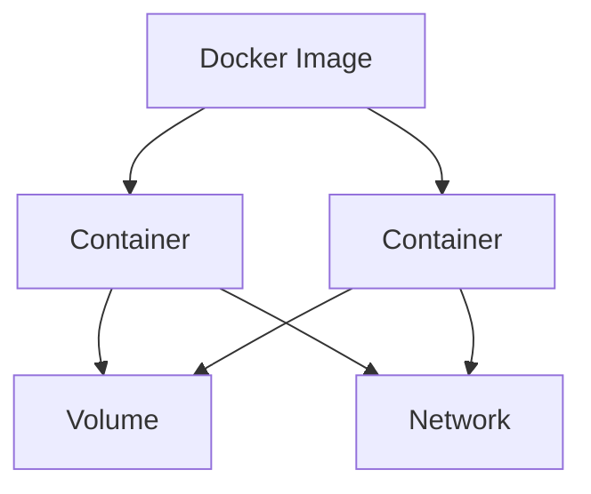

# Docker 容器技术

## 概述
Docker 是一个开源的容器化平台，它使用容器来打包、分发和运行应用程序。

## 核心概念


### Image（镜像）
- 只读模板
- 分层结构
- 可共享和复用
- 版本控制

### Container（容器）
- 镜像的运行实例
- 相互隔离
- 可启动、停止、删除
- 资源可限制

### Volume（数据卷）
- 持久化数据
- 容器间共享
- 独立于容器生命周期
- 支持多种驱动

## 常用命令

### 镜像管理
```bash
# 拉取镜像
docker pull nginx:latest

# 构建镜像
docker build -t myapp:1.0 .

# 查看镜像
docker images
```

### 容器操作
```bash
# 运行容器
docker run -d --name web -p 80:80 nginx

# 查看容器
docker ps

# 停止容器
docker stop web
```

## Dockerfile示例
```dockerfile
FROM node:14-alpine

WORKDIR /app

COPY package*.json ./
RUN npm install

COPY . .

EXPOSE 3000
CMD ["npm", "start"]
```

## 网络配置
1. Bridge Network
   - 默认网络模式
   - 容器间通信
   - 端口映射

2. Host Network
   - 共享主机网络
   - 最佳性能
   - 端口冲突风险

3. Overlay Network
   - 跨主机通信
   - Swarm模式
   - 服务发现

## 数据管理
1. Volumes
   - 持久化存储
   - 数据备份
   - 数据迁移

2. Bind Mounts
   - 主机文件映射
   - 开发环境
   - 配置文件

## 最佳实践
1. 镜像构建
   - 最小化层数
   - 合理使用缓存
   - 多阶段构建
   - 安全基础镜像

2. 容器运行
   - 资源限制
   - 健康检查
   - 日志管理
   - 容器编排

3. 安全配置
   - 最小权限
   - 镜像扫描
   - 网络隔离
   - 密钥管理

## Docker Compose
```yaml
version: '3'
services:
  web:
    build: .
    ports:
      - "3000:3000"
    environment:
      - NODE_ENV=production
    volumes:
      - ./data:/app/data
    depends_on:
      - db
  
  db:
    image: mongo:latest
    volumes:
      - mongodb_data:/data/db

volumes:
  mongodb_data:
```

## 故障排除
1. 常见问题
   - 容器启动失败
   - 网络连接问题
   - 存储空间不足

2. 调试工具
   - docker logs
   - docker inspect
   - docker stats

## 参考资料
1. [Docker Documentation](https://docs.docker.com/)
2. [Docker Hub](https://hub.docker.com/)
3. [Docker Compose Documentation](https://docs.docker.com/compose/)
