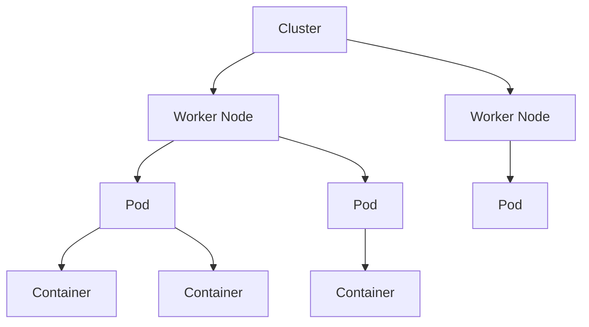

# Kubernetes 容器编排

## 概述
Kubernetes 是一个开源的容器编排平台，用于自动化应用程序的部署、扩展和管理。

## 核心概念


### Pod
- 最小部署单元
- 共享网络和存储
- 生命周期管理
- 资源限制

### Deployment
- Pod副本管理
- 滚动更新
- 版本控制
- 扩缩容

### Service
- 服务发现
- 负载均衡
- 网络代理
- 集群内访问

## 配置示例

### Pod配置
```yaml
apiVersion: v1
kind: Pod
metadata:
  name: nginx-pod
  labels:
    app: nginx
spec:
  containers:
  - name: nginx
    image: nginx:1.14.2
    ports:
    - containerPort: 80
```

### Deployment配置
```yaml
apiVersion: apps/v1
kind: Deployment
metadata:
  name: nginx-deployment
spec:
  replicas: 3
  selector:
    matchLabels:
      app: nginx
  template:
    metadata:
      labels:
        app: nginx
    spec:
      containers:
      - name: nginx
        image: nginx:1.14.2
        ports:
        - containerPort: 80
```

## 常用功能

### 资源管理
1. 命名空间
   - 资源隔离
   - 权限控制
   - 资源配额

2. 资源配额
   - CPU限制
   - 内存限制
   - 存储限制

3. 健康检查
   - 存活探针
   - 就绪探针
   - 启动探针

### 存储管理
1. PersistentVolume
   - 存储资源
   - 生命周期
   - 访问模式

2. StorageClass
   - 动态供应
   - 存储类型
   - 回收策略

### 网络管理
1. Service类型
   - ClusterIP
   - NodePort
   - LoadBalancer
   - ExternalName

2. Ingress
   - 路由规则
   - TLS配置
   - 负载均衡

## 最佳实践
1. 部署策略
   - 滚动更新
   - 蓝绿部署
   - 金丝雀发布

2. 高可用配置
   - 多副本部署
   - 反亲和性调度
   - 资源预留

3. 监控告警
   - 资源监控
   - 日志收集
   - 告警配置

## 常见运维操作
1. 集群管理
   - 节点维护
   - 版本升级
   - 备份恢复

2. 应用管理
   - 扩缩容
   - 版本回滚
   - 配置更新

3. 问题排查
   - 日志查看
   - 状态检查
   - 事件分析

## 参考资料
1. [Kubernetes Documentation](https://kubernetes.io/docs/home/)
2. [Kubernetes Patterns](https://k8spatterns.io/)
3. [Kubernetes Best Practices](https://cloud.google.com/kubernetes-engine/docs/best-practices)
