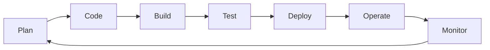

# DevOps 概览

## 简介
DevOps 是一种文化理念和实践方法，强调开发(Dev)和运维(Ops)团队之间的协作与整合。

## DevOps 生命周期

## 核心实践领域

### 持续集成/持续部署
- [GitHub Actions](./ci/github.md)
- [Jenkins](./ci/jenkins.md)
- GitLab CI/CD
- CircleCI

### 容器化技术
- [Docker](./container/docker.md)
- [Kubernetes](./container/kubernetes.md)
- Docker Compose
- Helm Charts

### 配置管理
- Ansible
- Chef
- Puppet
- Terraform

### 监控与日志
- Prometheus
- Grafana
- ELK Stack
- Datadog

### 版本控制
- Git
- GitFlow
- Trunk Based Development
- 版本控制策略

### 自动化测试
- 单元测试
- 集成测试
- 端到端测试
- 性能测试

## 最佳实践

### 基础设施即代码 (IaC)
- 环境一致性
- 版本控制
- 自动化部署
- 可重复性

### 微服务架构
- 服务解耦
- API管理
- 服务发现
- 负载均衡

### 安全实践
- 漏洞扫描
- 密钥管理
- 访问控制
- 合规检查

## 工具链集成
1. 开发工具
   - IDE集成
   - 代码分析
   - 构建工具

2. 协作工具
   - JIRA
   - Confluence
   - Slack
   - Teams

3. 运维工具
   - 监控平台
   - 日志管理
   - 告警系统

## 衡量指标
- 部署频率
- 变更前置时间
- 平均恢复时间
- 变更失败率

## 参考资料
1. [The DevOps Handbook](https://book.douban.com/subject/26875239/)
2. [Continuous Delivery](https://book.douban.com/subject/4723028/)
3. [Site Reliability Engineering](https://sre.google/sre-book/table-of-contents/)
