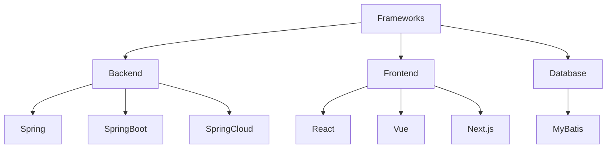

# 框架概览

## 主要分类

## 后端框架
1. [Spring Framework](./spring.md)
   - IoC容器
   - AOP编程
   - 事务管理

2. [Spring Boot](./springboot.md)
   - 自动配置
   - 嵌入式服务器
   - 起步依赖

3. [Spring Cloud](./springcloud.md)
   - 服务注册发现
   - 配置中心
   - 服务网关

## 前端框架
1. [React](./react.md)
   - 组件化
   - 虚拟DOM
   - Hooks特性

2. [Vue](./vue.md)
   - 响应式系统
   - 模板语法
   - 组件系统

3. [Next.js](./nextjs.md)
   - 服务端渲染
   - 静态生成
   - 路由系统

## 数据访问
1. [MyBatis](./mybatis.md)
   - ORM映射
   - 动态SQL
   - 缓存机制

## 框架选择
1. 考虑因素
   - 项目需求
   - 团队技术栈
   - 性能要求
   - 维护成本

2. 最佳实践
   - 技术选型
   - 架构设计
   - 版本管理

## 参考资料
1. [Spring Documentation](https://spring.io/docs)
2. [React Documentation](https://reactjs.org/docs)
3. [Vue Documentation](https://vuejs.org/guide)
