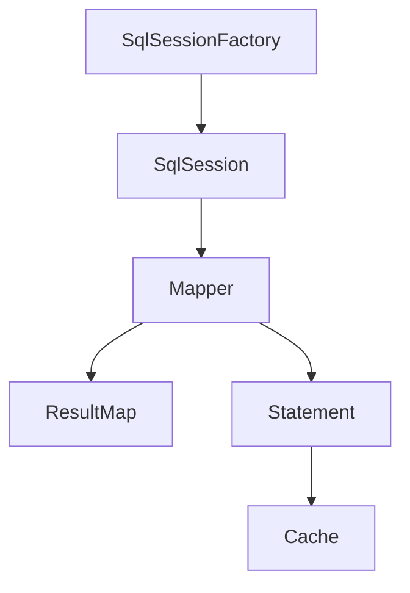

# MyBatis 框架

## 概述
MyBatis 是一个优秀的持久层框架，它支持自定义 SQL、存储过程以及高级映射。

## 核心组件


### Configuration（配置）
```xml
<?xml version="1.0" encoding="UTF-8" ?>
<!DOCTYPE configuration PUBLIC "-//mybatis.org//DTD Config 3.0//EN"
  "http://mybatis.org/dtd/mybatis-3-config.dtd">
<configuration>
  <environments default="development">
    <environment id="development">
      <transactionManager type="JDBC"/>
      <dataSource type="POOLED">
        <property name="driver" value="com.mysql.jdbc.Driver"/>
        <property name="url" value="jdbc:mysql://localhost:3306/test"/>
        <property name="username" value="root"/>
        <property name="password" value="root"/>
      </dataSource>
    </environment>
  </environments>
  <mappers>
    <mapper resource="UserMapper.xml"/>
  </mappers>
</configuration>
```

### Mapper（映射）
```xml
<?xml version="1.0" encoding="UTF-8" ?>
<!DOCTYPE mapper PUBLIC "-//mybatis.org//DTD Mapper 3.0//EN"
  "http://mybatis.org/dtd/mybatis-3-mapper.dtd">
<mapper namespace="com.example.UserMapper">
  <select id="getUser" resultType="User">
    SELECT * FROM users WHERE id = #{id}
  </select>
</mapper>
```

## 主要特性

### 动态SQL
1. if条件
2. choose/when/otherwise
3. trim/where/set
4. foreach循环

### 缓存机制
1. 一级缓存（Session级别）
2. 二级缓存（Namespace级别）
3. 自定义缓存

### 结果映射
1. 基本映射
2. 关联查询
3. 集合映射
4. 鉴别器

## 使用示例

### Java代码
```java
// 实体类
@Data
public class User {
    private Long id;
    private String name;
    private Integer age;
}

// Mapper接口
public interface UserMapper {
    User getById(Long id);
    List<User> findByName(String name);
    void insert(User user);
}

// 使用示例
try (SqlSession session = sqlSessionFactory.openSession()) {
    UserMapper mapper = session.getMapper(UserMapper.class);
    User user = mapper.getById(1L);
}
```

## 最佳实践
1. SQL管理
   - 使用XML管理复杂SQL
   - 注解管理简单SQL
   - 合理使用动态SQL

2. 性能优化
   - 合理使用缓存
   - 批量操作优化
   - 延迟加载

3. 代码规范
   - 统一命名规则
   - 注释完整性
   - 异常处理

## 常见问题
1. N+1查询问题
2. 缓存使用不当
3. 批量操作性能
4. 动态SQL维护

## 进阶特性
1. 插件机制
   - 分页插件
   - 乐观锁插件
   - 性能监控

2. TypeHandler
   - 自定义类型处理
   - 枚举类型处理
   - JSON类型处理

## 参考资料
1. [MyBatis官方文档](https://mybatis.org/mybatis-3/)
2. [MyBatis GitHub](https://github.com/mybatis/mybatis-3)
3. [MyBatis Spring集成](http://mybatis.org/spring/)
