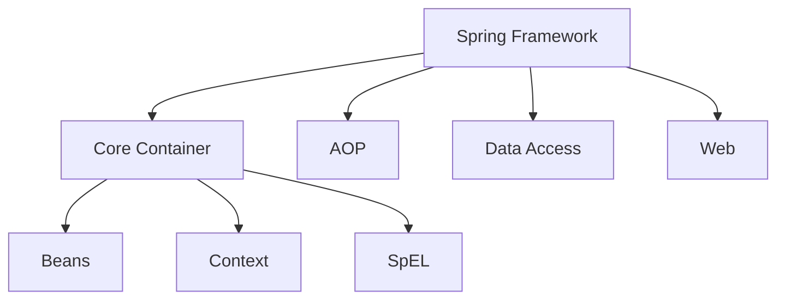

# Spring Framework

## 概述
Spring Framework 是一个开源的Java平台应用程序框架，提供全面的基础设施支持和依赖注入功能。

## 核心模块


## IoC容器
```java
@Configuration
public class AppConfig {
    @Bean
    public UserService userService() {
        return new UserServiceImpl();
    }
}

// 使用示例
ApplicationContext context = new AnnotationConfigApplicationContext(AppConfig.class);
UserService userService = context.getBean(UserService.class);
```

## 依赖注入

### 构造器注入
```java
@Service
public class UserServiceImpl implements UserService {
    private final UserRepository userRepository;
    
    @Autowired
    public UserServiceImpl(UserRepository userRepository) {
        this.userRepository = userRepository;
    }
}
```

### 属性注入
```java
@Service
public class OrderService {
    @Autowired
    private UserService userService;
    
    @Value("${app.name}")
    private String appName;
}
```

## AOP编程
```java
@Aspect
@Component
public class LoggingAspect {
    @Around("execution(* com.example.service.*.*(..))")
    public Object logMethod(ProceedingJoinPoint joinPoint) throws Throwable {
        // 方法执行前逻辑
        Object result = joinPoint.proceed();
        // 方法执行后逻辑
        return result;
    }
}
```

## 事务管理
```java
@Service
@Transactional
public class TransferService {
    @Transactional(isolation = Isolation.READ_COMMITTED)
    public void transfer(String fromAccount, String toAccount, BigDecimal amount) {
        // 转账逻辑
    }
}
```

## 主要特性

### 数据访问
1. JdbcTemplate
2. ORM集成
3. 事务管理
4. 缓存抽象

### Web开发
1. Spring MVC
2. WebFlux
3. REST支持
4. 视图技术

### 安全框架
1. 认证
2. 授权
3. 会话管理
4. 密码加密

## 最佳实践
1. 依赖注入
   - 构造器注入优于字段注入
   - 使用不可变对象
   - 避免循环依赖

2. AOP使用
   - 合理使用切面
   - 避免过度使用
   - 性能考虑

3. 事务管理
   - 合理设置隔离级别
   - 正确处理异常
   - 避免事务嵌套

## 常见问题
1. Bean生命周期
2. 循环依赖
3. 事务失效
4. 缓存穿透

## 性能优化
1. 启动优化
2. 运行时优化
3. 内存优化
4. GC调优

## 参考资料
1. [Spring Framework Documentation](https://docs.spring.io/spring-framework/docs/current/reference/html/)
2. [Spring Boot Documentation](https://docs.spring.io/spring-boot/docs/current/reference/html/)
3. [Spring Guides](https://spring.io/guides)
