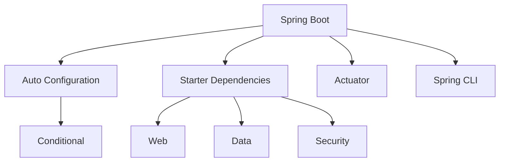

# Spring Boot

## 概述
Spring Boot 是一个快速开发Spring应用的框架，它简化了Spring应用的初始搭建和开发过程。

## 核心特性


## 基础配置
```yaml
server:
  port: 8080
  servlet:
    context-path: /api

spring:
  application:
    name: demo-service
  datasource:
    url: jdbc:mysql://localhost:3306/demo
    username: root
    password: root
  jpa:
    hibernate:
      ddl-auto: update
```

## 快速开始
```java
@SpringBootApplication
public class DemoApplication {
    public static void main(String[] args) {
        SpringApplication.run(DemoApplication.class, args);
    }
}

@RestController
@RequestMapping("/api/users")
public class UserController {
    @GetMapping("/{id}")
    public User getUser(@PathVariable Long id) {
        return userService.findById(id);
    }
}
```

## 主要功能

### 自动配置
1. 条件注解
   - @ConditionalOnClass
   - @ConditionalOnMissingBean
   - @ConditionalOnProperty

2. 配置属性
   - @ConfigurationProperties
   - @EnableConfigurationProperties
   - 松散绑定

### Starter依赖
1. spring-boot-starter-web
2. spring-boot-starter-data-jpa
3. spring-boot-starter-security
4. 自定义starter

### Actuator监控
1. 健康检查
2. 指标收集
3. 环境信息
4. 应用管理

## 最佳实践
1. 应用配置
   - 多环境配置
   - 外部化配置
   - 配置加密

2. 异常处理
   - 全局异常处理
   - 自定义错误页面
   - 错误响应格式

3. 安全实践
   - 认证配置
   - 授权规则
   - 安全头部

## 性能优化
1. JVM调优
   - 内存配置
   - GC策略
   - JIT编译

2. 应用优化
   - 懒加载
   - 缓存使用
   - 异步处理

## 部署方案
1. 传统部署
   - JAR部署
   - WAR部署
   - 系统服务

2. 容器化部署
   - Docker镜像
   - Kubernetes
   - Docker Compose

## 常见问题
1. 启动问题
   - 端口占用
   - 依赖冲突
   - 配置错误

2. 运行问题
   - 内存溢出
   - 连接泄漏
   - 性能降级

## 参考资料
1. [Spring Boot Documentation](https://docs.spring.io/spring-boot/docs/current/reference/html/)
2. [Spring Guides](https://spring.io/guides)
3. [Spring Boot in Action](https://www.manning.com/books/spring-boot-in-action)
