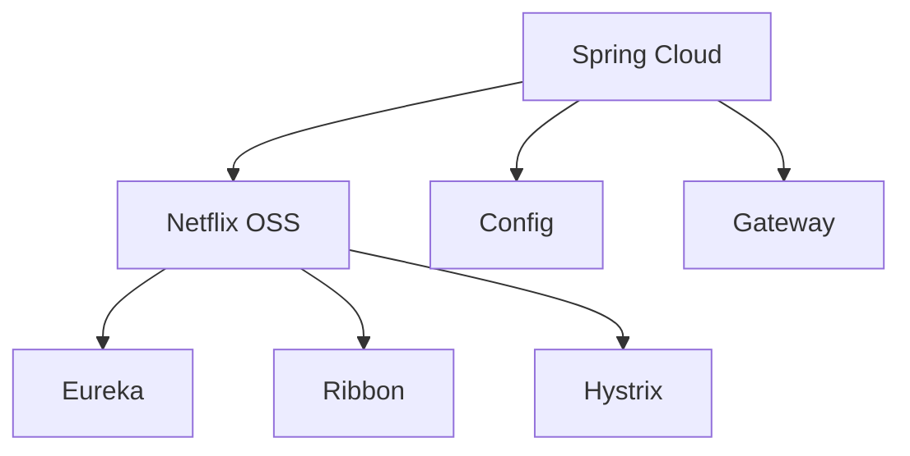

# Spring Cloud

## 概述
Spring Cloud 提供了一套完整的微服务解决方案，包括服务注册与发现、配置中心、负载均衡、断路器等组件。

## 核心组件


## 服务注册与发现
```yaml
# application.yml
spring:
  application:
    name: user-service
  cloud:
    nacos:
      discovery:
        server-addr: localhost:8848

server:
  port: 8080
```

## 配置中心
```yaml
spring:
  cloud:
    config:
      server:
        git:
          uri: https://github.com/config-repo
          search-paths: '{application}'
```

## 网关路由
```yaml
spring:
  cloud:
    gateway:
      routes:
        - id: user_route
          uri: lb://user-service
          predicates:
            - Path=/api/users/**
          filters:
            - StripPrefix=1
```

## 主要功能

### 服务治理
1. 服务注册
   - Nacos
   - Eureka
   - Consul

2. 负载均衡
   - Ribbon
   - LoadBalancer
   - 自定义策略

3. 熔断降级
   - Circuit Breaker
   - Fallback
   - 限流

### 分布式配置
1. 配置中心
   - Git存储
   - 配置刷新
   - 加密解密

2. 配置优先级
   - 本地配置
   - 远程配置
   - 环境配置

### API网关
1. 路由转发
2. 认证授权
3. 限流熔断
4. 日志监控

## 最佳实践
1. 服务设计
   - 服务粒度
   - 接口版本
   - 异常处理

2. 配置管理
   - 环境隔离
   - 安全加密
   - 动态刷新

3. 监控告警
   - 健康检查
   - 链路追踪
   - 性能监控

## 部署方案
1. 服务部署
   - 单机部署
   - 集群部署
   - Docker部署

2. 高可用配置
   - 多节点
   - 主从架构
   - 故障转移

## 常见问题
1. 服务注册
   - 服务上下线
   - 服务发现延迟
   - 注册中心同步

2. 配置中心
   - 配置刷新
   - 配置一致性
   - 安全问题

## 参考资料
1. [Spring Cloud Documentation](https://spring.io/projects/spring-cloud)
2. [Spring Cloud Alibaba](https://github.com/alibaba/spring-cloud-alibaba)
3. [Spring Cloud Netflix](https://cloud.spring.io/spring-cloud-netflix/reference/html/)
