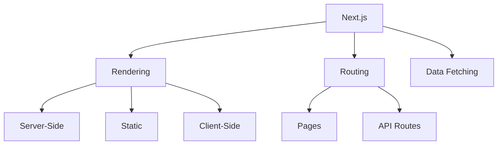

# Next.js Framework

## 概述
Next.js 是一个基于 React 的全栈开发框架，提供了服务端渲染、静态生成、API 路由等功能。

## 核心特性


## 基础配置
```javascript
// next.config.js
module.exports = {
  reactStrictMode: true,
  images: {
    domains: ['example.com'],
  },
  env: {
    API_URL: process.env.API_URL,
  }
}
```

## 页面路由
```typescript
// pages/index.tsx
import { GetStaticProps } from 'next'

export default function Home({ posts }) {
  return (
    <div>
      {posts.map(post => (
        <article key={post.id}>{post.title}</article>
      ))}
    </div>
  )
}

export const getStaticProps: GetStaticProps = async () => {
  const posts = await fetchPosts()
  return {
    props: { posts },
    revalidate: 60
  }
}
```

## 主要功能

### 渲染策略
1. 服务端渲染 (SSR)
   - getServerSideProps
   - 动态内容
   - SEO优化

2. 静态生成 (SSG)
   - getStaticProps
   - getStaticPaths
   - 增量静态再生成

3. 客户端渲染
   - SWR
   - 动态导入
   - 懒加载

### API路由
1. 基础路由
2. 动态路由
3. 中间件
4. API处理器

## 最佳实践
1. 项目结构
   - 页面组织
   - 组件复用
   - 样式管理

2. 性能优化
   - 图片优化
   - 字体优化
   - 代码分割

3. 开发体验
   - TypeScript
   - ESLint
   - 测试策略

## 部署方案
1. Vercel部署
   - 自动部署
   - 预览环境
   - 监控分析

2. 自托管
   - Docker部署
   - PM2管理
   - Nginx配置

## 常见问题
1. 水合问题
   - 客户端状态
   - DOM不匹配
   - 样式闪烁

2. 路由问题
   - 404处理
   - 重定向
   - 动态路由

## 参考资料
1. [Next.js Documentation](https://nextjs.org/docs)
2. [Next.js GitHub](https://github.com/vercel/next.js)
3. [Next.js Examples](https://github.com/vercel/next.js/tree/canary/examples)
