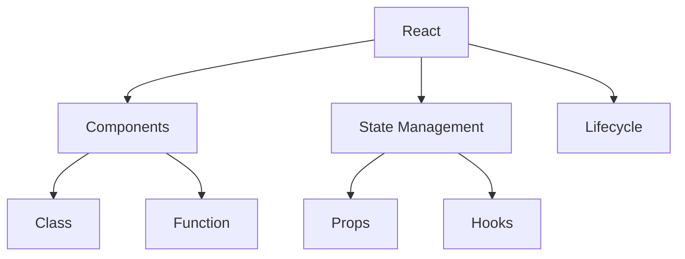

# React 框架

## 概述
React 是一个用于构建用户界面的 JavaScript 库，主要用于构建单页应用和移动应用。

## 核心概念


## 组件示例
```typescript
// 函数组件
function Welcome({ name }: { name: string }) {
  const [count, setCount] = useState(0);
  
  useEffect(() => {
    document.title = `Clicked ${count} times`;
  }, [count]);
  
  return (
    <div>
      <h1>Hello, {name}</h1>
      <button onClick={() => setCount(c => c + 1)}>
        Click me: {count}
      </button>
    </div>
  );
}
```

## 主要特性

### Hooks
1. useState
   - 状态管理
   - 状态更新
   - 状态共享

2. useEffect
   - 副作用处理
   - 清理机制
   - 依赖管理

3. 自定义Hooks
   - 逻辑复用
   - 状态封装
   - 功能组合

### 状态管理
1. Context
2. Redux
3. MobX
4. Zustand

## 最佳实践
1. 组件设计
   - 单一职责
   - 组件复用
   - Props设计

2. 性能优化
   - 虚拟DOM
   - 组件缓存
   - 懒加载

3. 代码组织
   - 文件结构
   - 命名规范
   - 类型定义

## 常见模式
1. 高阶组件 (HOC)
2. Render Props
3. 组合模式
4. 提供者模式

## 路由管理
```typescript
import { BrowserRouter, Route, Routes } from 'react-router-dom';

function App() {
  return (
    <BrowserRouter>
      <Routes>
        <Route path="/" element={<Home />} />
        <Route path="/about" element={<About />} />
        <Route path="/users/:id" element={<User />} />
      </Routes>
    </BrowserRouter>
  );
}
```

## 服务端交互
1. Fetch API
2. Axios
3. React Query
4. SWR

## 测试策略
1. 单元测试
   - Jest
   - React Testing Library
   - Enzyme

2. 集成测试
   - Cypress
   - Playwright
   - TestCafe

## 参考资料
1. [React Documentation](https://reactjs.org/docs/getting-started.html)
2. [React Hooks](https://reactjs.org/docs/hooks-intro.html)
3. [React TypeScript](https://github.com/typescript-cheatsheets/react)
