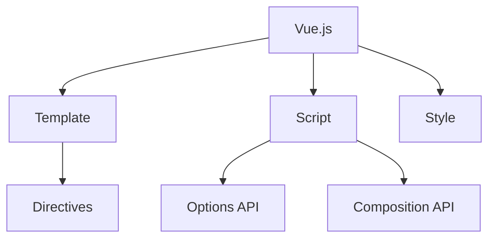

# Vue.js 框架

## 概述
Vue.js 是一个渐进式的 JavaScript 框架，用于构建用户界面，可以从构建简单的单页应用到复杂的企业级应用。

## 核心概念


## 组件示例
```vue
<template>
  <div class="counter">
    <h1>{{ title }}</h1>
    <button @click="increment">Count: {{ count }}</button>
  </div>
</template>

<script setup lang="ts">
import { ref } from 'vue'

const title = ref('Counter App')
const count = ref(0)

const increment = () => {
  count.value++
}
</script>

<style scoped>
.counter {
  text-align: center;
}
</style>
```

## 主要特性

### 响应式系统
1. ref/reactive
2. computed
3. watch/watchEffect
4. 生命周期钩子

### 组件通信
1. Props
2. Emit
3. Provide/Inject
4. Vuex/Pinia

### 模板语法
1. 指令
   - v-if/v-show
   - v-for
   - v-model
   - v-bind
   - v-on

2. 插槽
   - 默认插槽
   - 具名插槽
   - 作用域插槽

## 最佳实践
1. 组件设计
   - 单一职责
   - Props验证
   - 组件通信

2. 性能优化
   - 懒加载
   - Keep-alive
   - 虚拟列表

3. 代码组织
   - 文件结构
   - 命名规范
   - 类型定义

## 路由管理
```typescript
import { createRouter, createWebHistory } from 'vue-router'

const router = createRouter({
  history: createWebHistory(),
  routes: [
    {
      path: '/',
      component: () => import('./views/Home.vue')
    },
    {
      path: '/about',
      component: () => import('./views/About.vue')
    }
  ]
})
```

## 状态管理
```typescript
// Pinia Store
import { defineStore } from 'pinia'

export const useUserStore = defineStore('user', {
  state: () => ({
    name: '',
    isLoggedIn: false
  }),
  actions: {
    login(username: string) {
      this.name = username
      this.isLoggedIn = true
    }
  }
})
```

## 测试策略
1. 单元测试
   - Vitest
   - Vue Test Utils
   - Jest

2. 端到端测试
   - Cypress
   - Playwright
   - TestCafe

## 参考资料
1. [Vue.js Documentation](https://vuejs.org/guide/introduction.html)
2. [Vue Router](https://router.vuejs.org/)
3. [Pinia](https://pinia.vuejs.org/)
