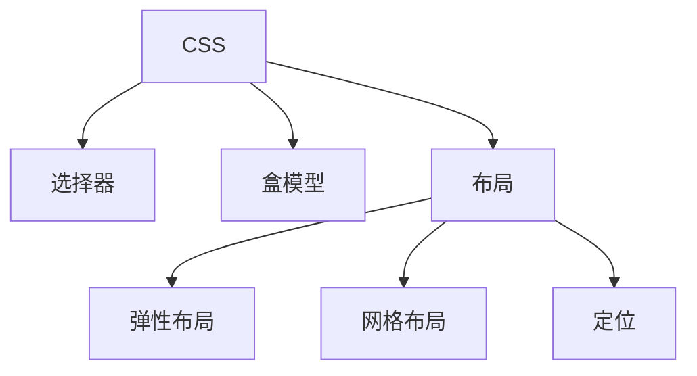

# CSS 样式表

## 概述
CSS (Cascading Style Sheets) 是一种用于描述HTML文档样式的语言，控制网页的视觉表现。

## 核心概念


## 选择器
```css
/* 基本选择器 */
.class-name { /* 类选择器 */ }
#id-name { /* ID选择器 */ }
div { /* 标签选择器 */ }

/* 组合选择器 */
div > p { /* 子选择器 */ }
div + p { /* 相邻选择器 */ }
div ~ p { /* 兄弟选择器 */ }

/* 伪类和伪元素 */
a:hover { /* 鼠标悬停 */ }
p::first-line { /* 第一行 */ }
```

## 盒模型
```css
/* 标准盒模型 */
.box {
    width: 100px;
    height: 100px;
    padding: 20px;
    border: 1px solid black;
    margin: 10px;
}

/* 替代盒模型 */
.border-box {
    box-sizing: border-box;
}
```

## 布局示例
```css
/* Flexbox布局 */
.flex-container {
    display: flex;
    justify-content: space-between;
    align-items: center;
    flex-wrap: wrap;
}

/* Grid布局 */
.grid-container {
    display: grid;
    grid-template-columns: repeat(3, 1fr);
    gap: 20px;
    grid-auto-rows: minmax(100px, auto);
}

/* 定位 */
.relative {
    position: relative;
    top: 10px;
    left: 20px;
}

.absolute {
    position: absolute;
    top: 0;
    right: 0;
}
```

## 响应式设计
```css
/* 媒体查询 */
@media screen and (max-width: 768px) {
    .container {
        flex-direction: column;
    }
}

/* 弹性单位 */
.fluid {
    font-size: clamp(1rem, 2.5vw, 2rem);
    width: min(90%, 1200px);
    margin-inline: auto;
}
```

## 动画效果
```css
/* 过渡 */
.transition {
    transition: all 0.3s ease-in-out;
}

/* 变换 */
.transform:hover {
    transform: scale(1.1) rotate(5deg);
}

/* 动画 */
@keyframes slideIn {
    from {
        transform: translateX(-100%);
    }
    to {
        transform: translateX(0);
    }
}

.animate {
    animation: slideIn 0.5s ease-out;
}
```

## CSS变量与主题
```css
:root {
    --primary-color: #007bff;
    --secondary-color: #6c757d;
    --spacing-unit: 8px;
}

.theme-dark {
    --background: #1a1a1a;
    --text-color: #ffffff;
}
```

## 最佳实践
1. 命名规范
   - BEM方法论
   - 语义化命名
   - 模块化CSS

2. 性能优化
   - 选择器优化
   - 继承与复用
   - 按需加载

3. 浏览器兼容
   - 前缀处理
   - 降级方案
   - 特性检测

## 参考资料
1. [MDN CSS Documentation](https://developer.mozilla.org/en-US/docs/Web/CSS)
2. [CSS Tricks](https://css-tricks.com/)
3. [Can I Use](https://caniuse.com/)
