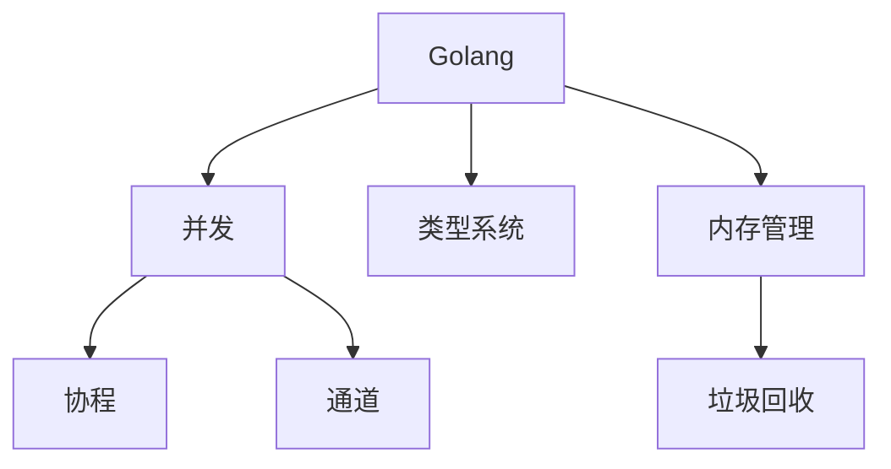

# Golang 编程语言

## 概述
Go是一种开源的编程语言，它能让构造简单、可靠且高效的软件变得容易。

## 核心特性


## 基础语法
```go
// 包声明
package main

// 导入包
import (
    "fmt"
    "time"
)

// 结构体定义
type User struct {
    Name string
    Age  int
}

// 接口定义
type Worker interface {
    Work() error
}

// 函数定义
func main() {
    // 变量声明
    var user = User{Name: "John", Age: 30}
    
    // 切片使用
    numbers := []int{1, 2, 3}
    
    // 循环
    for _, num := range numbers {
        fmt.Println(num)
    }
}
```

## 并发编程
1. Goroutines
   ```go
   go func() {
       // 并发执行
   }()
   ```

2. Channels
   ```go
   ch := make(chan int)
   go func() {
       ch <- 42
   }()
   value := <-ch
   ```

## 内存管理
1. 垃圾回收
2. 内存分配
3. 逃逸分析
4. 堆栈管理

## 工程实践
1. 项目结构
   - Go Modules
   - 包管理
   - 依赖处理

2. 测试
   - 单元测试
   - 基准测试
   - 性能分析

3. 错误处理
   - error接口
   - panic/recover
   - 错误包装

## 最佳实践
1. 代码组织
   - 包设计
   - 接口设计
   - 错误处理

2. 性能优化
   - 并发控制
   - 内存管理
   - 性能分析

## 常用工具
1. go fmt
2. go vet
3. go test
4. go mod

## 参考资料
1. [Go Documentation](https://golang.org/doc/)
2. [Effective Go](https://golang.org/doc/effective_go)
3. [Go by Example](https://gobyexample.com/)
