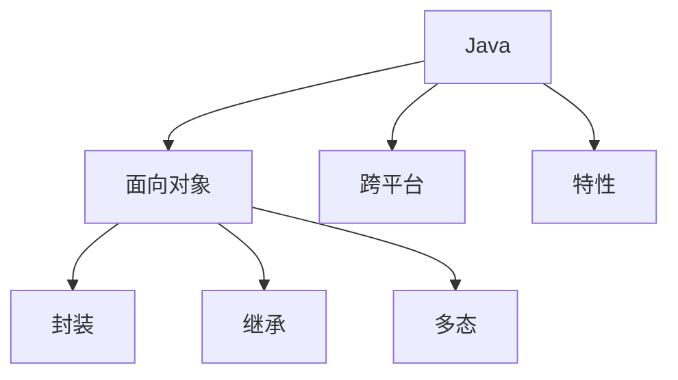

# Java 编程语言

## 概述
Java是一种广泛使用的面向对象的编程语言，具有"一次编写，到处运行"的特性。

## 核心特性


## 基础语法
```java
// 类定义
public class Example {
    // 成员变量
    private String name;
    private int age;
    
    // 构造方法
    public Example(String name, int age) {
        this.name = name;
        this.age = age;
    }
    
    // 接口实现
    public interface Runnable {
        void run();
    }
    
    // 泛型使用
    public <T> void printArray(T[] array) {
        for(T element : array) {
            System.out.println(element);
        }
    }
}
```

## 集合框架
1. List接口
   - ArrayList
   - LinkedList
   - Vector

2. Set接口
   - HashSet
   - TreeSet
   - LinkedHashSet

3. Map接口
   - HashMap
   - TreeMap
   - LinkedHashMap

## 并发编程
1. 线程基础
   - Thread类
   - Runnable接口
   - Callable接口

2. 同步机制
   - synchronized
   - volatile
   - Lock接口

3. 线程池
   - ThreadPoolExecutor
   - ExecutorService
   - CompletableFuture

## JVM架构
1. 内存模型
   - 堆区
   - 栈区
   - 方法区

2. 垃圾回收
   - GC算法
   - 垃圾收集器
   - GC调优

## 最佳实践
1. 代码规范
   - 命名规范
   - 异常处理
   - 日志记录

2. 性能优化
   - JVM调优
   - 代码优化
   - 并发控制

## 常用工具
1. 构建工具
   - Maven
   - Gradle

2. 开发工具
   - IDEA
   - Eclipse

3. 调试工具
   - JConsole
   - VisualVM

## 参考资料
1. [Java Documentation](https://docs.oracle.com/en/java/)
2. [Effective Java](https://www.oreilly.com/library/view/effective-java-3rd/9780134686097/)
3. [Java Tutorials](https://docs.oracle.com/javase/tutorial/)
