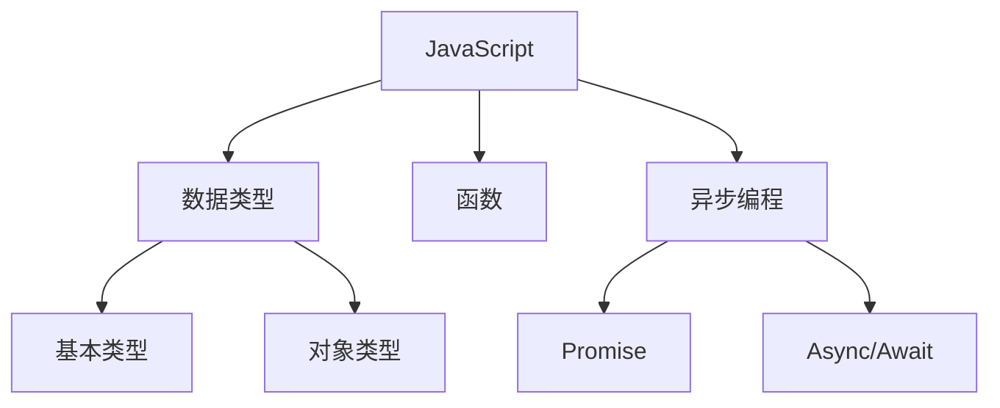

# JavaScript 编程语言

## 概述
JavaScript是一种高级的、解释型的编程语言，主要用于Web开发，支持面向对象、函数式和命令式编程范式。

## 核心概念


## 基础语法
```javascript
// 变量声明
let name = 'John';
const age = 30;

// 函数定义
function greet(name) {
    return `Hello, ${name}!`;
}

// 箭头函数
const add = (a, b) => a + b;

// 类定义
class Person {
    constructor(name) {
        this.name = name;
    }
    
    sayHello() {
        console.log(`Hello, I'm ${this.name}`);
    }
}
```

## 异步编程
1. Promise
   ```javascript
   const fetchData = () => {
       return new Promise((resolve, reject) => {
           // 异步操作
       });
   };
   ```

2. Async/Await
   ```javascript
   async function getData() {
       try {
           const result = await fetchData();
           return result;
       } catch (error) {
           console.error(error);
       }
   }
   ```

## 模块化
1. ES Modules
   ```javascript
   // 导出
   export const config = {};
   export default class {};
   
   // 导入
   import { config } from './config';
   import DefaultExport from './module';
   ```

## 最佳实践
1. 代码组织
   - 模块化
   - 组件化
   - 函数式编程

2. 性能优化
   - 代码分割
   - 懒加载
   - 缓存策略

3. 错误处理
   - 异常捕获
   - 错误边界
   - 日志记录

## 常用工具
1. 包管理
   - npm
   - yarn
   - pnpm

2. 构建工具
   - webpack
   - vite
   - rollup

## 参考资料
1. [MDN JavaScript Guide](https://developer.mozilla.org/en-US/docs/Web/JavaScript/Guide)
2. [JavaScript.info](https://javascript.info/)
3. [Clean Code JavaScript](https://github.com/ryanmcdermott/clean-code-javascript)
