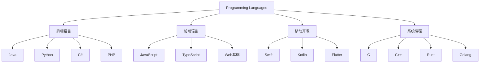

# 编程语言概览

## 语言分类

## 后端语言
1. [Java](./java.md)
   - 企业级应用
   - Spring生态
   - 跨平台

2. [Python](./python.md)
   - AI/机器学习
   - 数据分析
   - Web开发

3. C#
   - .NET平台
   - 企业应用
   - 游戏开发

4. PHP
   - Web开发
   - 快速部署
   - CMS系统

## 系统编程
1. [Golang](./golang.md)
   - 云原生
   - 高并发
   - 系统工具

2. C/C++
   - 系统编程
   - 游戏引擎
   - 性能关键

3. Rust
   - 内存安全
   - 并发编程
   - 系统开发

## 前端技术
1. [JavaScript](./javascript.md)
   - 动态类型
   - 函数式编程
   - 异步编程

2. [TypeScript](./typescript.md)
   - 静态类型
   - 面向对象
   - JavaScript超集

3. Web基础
   - [HTML](./html.md)
   - [CSS](./css.md)

## 移动开发
1. Swift
   - iOS开发
   - macOS应用
   - 性能优化

2. Kotlin
   - Android开发
   - 服务端开发
   - 跨平台

3. Dart/Flutter
   - 跨平台开发
   - 响应式UI
   - 热重载

## 脚本语言
1. [Node.js](./nodejs.md)
   - 服务端JavaScript
   - 事件驱动
   - 非阻塞I/O

2. [Shell](./shell.md)
   - 系统脚本
   - 自动化任务
   - 命令行工具

## 技术趋势
1. 云原生开发
   - Go
   - Rust
   - Python

2. 跨平台开发
   - Flutter
   - React Native
   - Kotlin Multiplatform

3. AI/机器学习
   - Python
   - R
   - Julia

## 参考资料
1. [Programming Language Pragmatics](https://www.cs.rochester.edu/~scott/pragmatics/)
2. [TIOBE Index](https://www.tiobe.com/tiobe-index/)
3. [GitHub Language Stats](https://madnight.github.io/githut/)