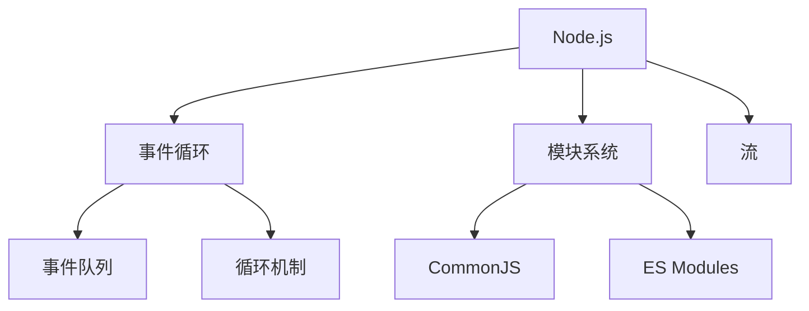

# Node.js 运行时

## 概述
Node.js是一个基于Chrome V8引擎的JavaScript运行时，用于构建快速、可扩展的网络应用程序。

## 核心概念


## 基础示例
```javascript
// 模块导入
const http = require('http');
const fs = require('fs').promises;

// 创建HTTP服务器
const server = http.createServer(async (req, res) => {
    try {
        const data = await fs.readFile('index.html');
        res.writeHead(200, { 'Content-Type': 'text/html' });
        res.end(data);
    } catch (err) {
        res.writeHead(500);
        res.end('Server Error');
    }
});

server.listen(3000, () => {
    console.log('Server running at http://localhost:3000/');
});
```

## 核心模块
1. 文件系统(fs)
2. HTTP/HTTPS
3. 事件(Events)
4. 流(Stream)
5. 缓冲区(Buffer)

## 异步编程
1. 回调函数
2. Promise
3. Async/Await
4. 事件发射器

## 包管理
1. NPM
   - 包安装
   - 版本管理
   - 脚本运行

2. Package.json
   - 依赖管理
   - 项目配置
   - 脚本定义

## 最佳实践
1. 错误处理
   - 异步错误
   - 未捕获异常
   - 错误传播

2. 性能优化
   - 内存管理
   - CPU优化
   - 集群使用

3. 安全考虑
   - 依赖审计
   - 输入验证
   - 安全标头

## 调试与监控
1. 调试工具
   - Node调试器
   - VS Code集成
   - Chrome DevTools

2. 性能监控
   - 内存泄漏
   - CPU分析
   - 日志记录

## 参考资料
1. [Node.js Documentation](https://nodejs.org/docs/)
2. [Node.js Best Practices](https://github.com/goldbergyoni/nodebestpractices)
3. [Node.js Design Patterns](https://www.packtpub.com/product/node-js-design-patterns-third-edition/9781839214110)
